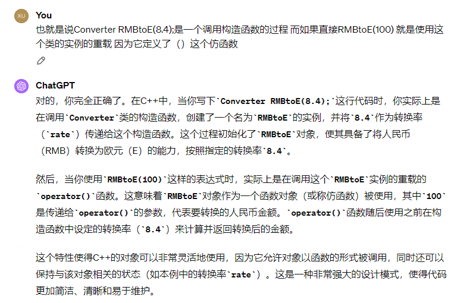
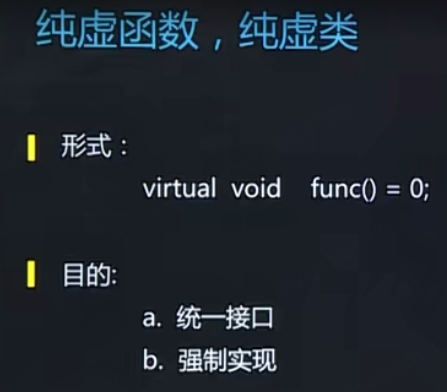
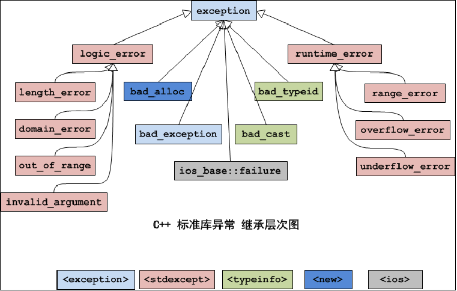
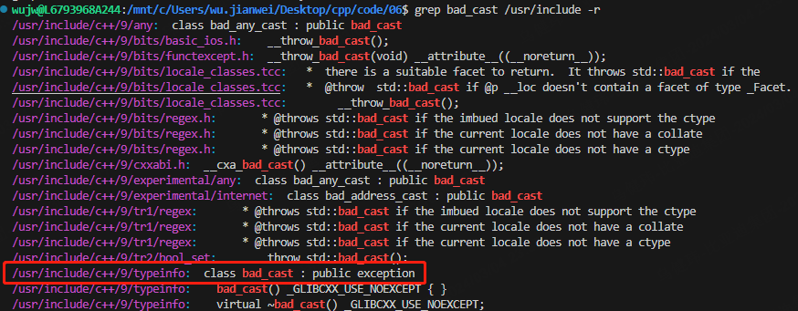
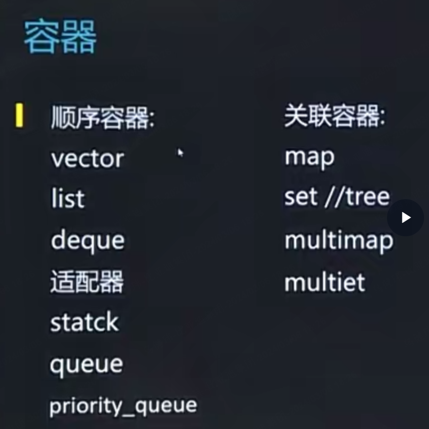
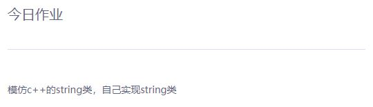

# C++ & Qt learning

## C++

#### 引用：

ref.cpp

```c++
#include<stdio.h>
  
int main() {
        int a = 100;
        int &b = a;
        printf("a = %d\n", a);
        printf("b = %d\n", b);
        printf("addr:a = %p\n", &a);
        printf("addr:b = %p\n", &b);
}
```

相当于就是取一个别名

引用实现交换函数（bic语言用指针简单）：

```c++
#include<stdio.h>
/*
int swap(int *a, int *b)
{
        *a ^= *b;
        *b ^= *a;
        *a ^= *b;

}
//int *a 定义了一个指针变量 a，它可以指向一个整数值的内存地址。在C语言中，这个声明表示 a 是一个指向整数值的指针。

*a 表示取出指针 a 所指向的值，因为 * 是解引用操作符。在C语言中，* 运算符用于解引用指针，获取指针所指向的值
*/
void swap(int &a, int &b)
//reference=give it a nickname
{
        a ^= b;
        b ^= a;
        a ^= b;

}
int main() {
        int a =100;
        int b = 10;
        printf("a = %d, b = %d\n", a, b);
//      swap(&a, &b);
        swap(a, b);
        printf("a = %d, b = %d\n", a, b);
}
```


#### 默认参数：

debug.cpp

```c++
#include <stdio.h>

//void sortarr(int *arr, int len, int flag=UP);
void debug(const char *ptr = "---------------")
//default parameter
{
        printf("%s\n", ptr);
}

int main()
{
        debug();
        debug();
        debug();
        debug();
        debug();
        debug();
        debug("hello");
        debug("world");
}
```

默认参数就是一些常用的 不想每次都传参的地方 给它一个默认值

默认参数应该从右往左 赋值 比如有三个参数 只传了两 如果第一个就赋了默认参数 编译器会不知道这两个参数是给谁的


#### 函数重载：

cmp.cpp

```c++
#include <stdio.h>
#include <string.h>

/*
int intcmp(int a, int b)
{
        return a-b;
}

int scmp(const char *str1, const char *str2)
{
        return strcmp(str1, str2);
}
*/
int cmp(int a, int b)
{
        return a-b;
}

int cmp(const char *str1, const char *str2)
{
        return strcmp(str1, str2);
}
int main()
{
        printf("%d\n", cmp(1, 2));
        printf("%d\n", cmp("aaaaaa", "bbbb"));
}
```

就是不同函数可以取相同名字 然后编译器通过传入的参数的类型不同 来做区分

当然 如果参数意义 就不能才写一个名字一样的了 （redefinition是会报错的）

#### 内存申请

在堆中申请内存(堆内存申请)：

new_delet.cpp

```c++
#include <stdio.h>
#include <malloc.h>
#include <string.h>

int main()
{
/*
//c语言是用malloc和free 1.申请 2.传入参数到内存 3.打印 4.释放
        char *p = (char *)malloc(10);
        strcpy(p, "hello");

        printf("p: %s\n", p);

        free(p);
*/

//c++分为两种 一种是颗粒状的 比如int 还有一种是连续的一块内存 
//delete 用于释放使用 new 分配的单个对象的内存。如果你使用 new 分配了一个单个对象的内存，应该使用 delete 来释放它。
//delete[] 用于释放使用 new[] 分配的数组的内存。如果你使用 new[] 分配了一个数组的内存，应该使用 delete[] 来释放它。这是因为 new[] 分配的内存包含了数组的大小信息，delete[] 知道需要释放的内存大小。

        int *intp = new int;//(int*)malloc(sizeof(int));

        *intp = 100;

        printf("*intp = %d\n", *intp);

        delete intp;
/////////////////////////////////////////////////////////
        char *p = new char[10];

        strcpy(p, "hello");

        printf("p: %s\n", p);

        delete [] p;

}
```

跟malloc其实差不多用new对于malloc 用delete对应free

#### 面向对象的思想：

先把数据封装成结构体 然后把需要直接可以使用的函数封装好

arr.h

```c
#ifndef _ARR_
#define _ARR_

typedef struct arr{
	int data[100];
	int tail;
}ARR;

void init(ARR *arr);
void addtail(ARR *arr, int data);
void show(ARR *arr);

#endif
```

arr.c

```c
#include "arr.h"
#include <stdio.h>

void init(ARR *arr)
{
	arr->tail = 0;
}

void addtail(ARR *arr, int data)
{
	arr->data[arr->tail++] = data;
}

void show(ARR *arr)
{
	int i = 0;
	for(;i<arr->tail; i++)
		printf("%d, ", arr->data[i]);
	printf("\n");
}
```

main.c

```c
#include "arr.h"
#include<stdio.h>

int main()
{
	ARR arr;
	init(&arr);

	int n = 100;
	while(n--)
		addtail(&arr, n);

	show(&arr);

//创建就变得很容易

	ARR arr1;
	init(&arr1);

	int i = 0;
	for(;i<100; i++)
		addtail(&arr1, i);

	show(&arr1);
}
```

方法和数据不应该独立 而应该有一个绑定关系 （用这个对象 就应该用这些方法）

最后的结论：我拿到对象就应该拿到它的操作方法

c语言怎么做到这个事情呢 把函数的声明放到结构体中去

首先在arr.h中声明一个结构体 声明的过程中还说了我身上有一堆对自己操作的方法集（其实就是函数指针） 

```c
#ifndef _ARR_
#define _ARR_

typedef struct arr{
	int data[100];
	int tail;

	void (*addtail)(struct arr *arr, int data);
	void (*show)(struct arr *arr);
}ARR;

void init(struct arr *arr);

#endif
```

然后把这些函数单独的去实现 虽然单独实现跟之前一样 但他们并不一样

```c
#include "arr.h"
#include <stdio.h>


static void addtail(ARR *arr, int data)
{
	arr->data[arr->tail++] = data;
}

static void show(ARR *arr)
{
	int i = 0;
	for(;i<arr->tail; i++)
		printf("%d, ", arr->data[i]);
	printf("\n");
}

void init(ARR *arr)
{
	arr->tail = 0;

	arr->addtail = addtail;
	arr->show = show;
}
```

最后main函数去使用这些方法

```c
#include "arr.h"

int main()
{
	ARR arr;
	init(&arr);

	int n = 10;
	while(n--)
		arr.addtail(&arr, n);


	arr.show(&arr);

//	arr.tail = 0;

	arr.show(&arr);

}
```

使用的时候是通过对象 找到方法 来操作对象的 

但因为初始化 一定是用户一个主动地动作 所以只能放外面 来实现arr的init 让其他的函数指针 一定要真实的有指向 并且 不止要初始化自己 还要初始化其他的函数 告诉他们应该指向哪里（指向当前文件夹下的show和addtail）

只有arr可以调用这些函数 其他人不行

几点追求：

1.别人不能写一条语句就破坏数据（arr.tail = 0;）

2.不希望已经找到对象了还要传这个对象作为参数（arr.addtail(&arr, n);）

3.初始化在定义的时候能不能就构建好 不用专门初始化（ARR arr;init(&arr);）


#### 类的概念

比较像结构体 不过可以在里面定义函数

public：放在我的类中 但又希望外面的人可以基于我的对象去使用 就开放成public接口

private：如果不想外面的人直接访问 比如直接改 因为这样改可以不安全 像之前那个tail一样 不过也可以定义一个接口在public里 从外部传参进来 也就是外部不能直接掉我的private 但可以通过public来内部修改这个值

C++只要是类的内部 都是可以互相调用的

private里面一般是数据成员 public里一般是函数成员 数据成员和函数成员一般是绑定关系

好处：

- 省去了繁琐的注册的动作 
- 省去了没有必要的自己本身的参数 代码就会变得简洁

#### 构造函数

类名相同的成员函数

也叫构造函数 第一时间生成的时候会主动调用这个构造函数

构造函数一般的作用：初始化

对象构造的时候就完成初始化

构造函数是在对象创建的时候会去主动调用的函数 不用手动去起

#### 析构函数

类的析构函数：当对象销毁的时候会被调用

对象的生命周期在大括号结束就结束了

一般如果在构造函数里做了堆内存的申请 那就应该在析构函数中进行释放 以免造成内存泄露

类里面一般都包括：构造函数、析构函数、普通成员函数、普通数据成员

算法脱离了数据 没有意义

数据脱离了算法 也没有意义

类的作用：把方法和数据集中在一起

写内核的大佬们就是用c去写面向对象的思想 

c++ java都是面向对象的语言

虽然c也能实现 但会有很多地方很赘余 很没必要 

在写面向对象的应用的时候 还是用面向对象的语言来写会方便很多

arr.h

```c++
#ifndef _ARR_
#define _ARR_

#if 0
typedef struct arr{
	int data[100];
	int tail;

	void (*addtail)(struct arr *arr, int data);
	void (*show)(struct arr *arr);
}ARR;

void init(struct arr *arr);
#endif

class ARR{
public:
	ARR():tail(0){
//		tail = 0;
	}

	void addtail(int data);
	void show(void);
	
	friend void rev(ARR &arr);
	
private:
	int data[100];
	int tail;
};


#endif
```

arr.c

```c++
#include "arr.h"
#include <stdio.h>


void ARR::addtail(int data)
{
	this->data[tail++] = data;//变量名data和private里面的data重名 使用this指针来区分
}

void ARR::show(void)
{
	int i = 0;
	for(;i<tail; i++)
		printf("%d, ", data[i]);
	printf("\n");
}

/*
void init(ARR *arr)
{
	arr->tail = 0;

	arr->addtail = addtail;
	arr->show = show;
}
*/
```

main.c

```c++
#include "arr.h"

void rev(ARR &arr)
{
	int i = 0;
	for(;i<arr.tail/2; i++)
	{
		int tem = arr.data[i];
		arr.data[i] = arr.data[arr.tail-i-1];
		arr.data[arr.tail-i-1] = tem;
	}
}

int main()
{
#if 0
	ARR arr;
	init(&arr);

	int n = 10;
	while(n--)
		arr.addtail(&arr, n);


	arr.show(&arr);

//	arr.tail = 0;

	arr.show(&arr);
#endif
	ARR arr;

	arr.addtail(1);
	arr.addtail(2);
	arr.addtail(3);
	arr.addtail(4);

	arr.show();
	//reverse
	rev(arr);

	arr.show();
}
```

#### 类的理解

class_construct.cpp

```c++
class A{
public:
	A()
	{
		printf("A()\n");
	}

	A(int data)
	{
		printf("A(int data)\n");
	}
	~A(){
		printf("A~~~~~~~~~~~~~\n");
	}
};

int main()
{
	//called when new object is created!

	A *p = new A(1000);//堆内存的创建
	A  x;
	A  m(100);
	A  y = 10;//（隐式）相当于A有（10）
	A  z = y;//拷贝构造函数（隐式）
}
```

只要有新的对象产生 就一定调用了构造函数 也就一定调用了析构函数

#### 浅拷贝

真实的拷贝应该是完整备份 不然会只复制快捷方式（指针）应该进行深拷贝 否则在结束的时候会出现二次释放

class_copy.cpp

```c++
#include <stdio.h>
#include <string.h>

class A{
public:
	A()
	{
		printf("A()\n");
		p = new char[10];
		strcpy(p, "hello");


		printf("p: %s\n", p);
		printf("p: %s\n", this->p);
	}

	A(const A &x)//拷贝构造函数 为了深拷贝
	{
		printf("A(const A &x)\n");
		p = new char[10];
		strcpy(p, x.p);	
	}

	~A()
	{
		printf("~A()\n");
		delete [] p;
	}

private:
	char *p;
};

int main()
{
	A x;

	A y = x;


//	y = x;
}
```

浅拷贝就是会容易导致二次释放的问题 这个就是rust中可以规避的

析构函数大部分时候是空白的 只有你申请了堆空间才会进行主动回收

在c++的类中 都可以不定义this这个指针 但是都可以使用这个this指针

成员

#### 深拷贝

const.cpp

```c++
#include <stdio.h>

class A{
public:
	A(int a = 50, int data = 1000):b(data){//b(data)这个是常数据的赋值方法 也叫初始化表
//		b = data；//跟b(data)是一样的
		this->a = a;//以免编译器分不清传入的传入参数和成员
		printf("AAAAAAAAA\n");
	}
	~A(){
		printf("~~~~~~~~~\n");
	}
	
	void show(void) const//常函数 因为不会被修改
	{
		printf("b = %d\n", b);
		printf("a = %d\n", a);
	//	a++;
	//	b++;
	}
private:
	int a;
	const int b;//常对象：b的初始化只能在构造函数第一次
};

int main()
{
	A x(10);
	x.show();

	A y(100);
	y.show();

	A z;
	z.show();
}
```

c++经常用const来定义一个常量

常函数不能修改成员值

静态

static.cpp

```c++
#include <stdio.h>

class A{
public:
	static void func(void)
	{
		printf("xxxxxxxxx\n");
	}

	static int data;
};

int A::data = 10;//静态成员初始化

int main()
{
	A a;
	a.func();
	A::func();

	A x;
	x.data = 100;
	printf("x.data = %d\n", x.data);

	A::data = 1000;//虽然没有修改x.data 但还是修改了x.data的值

	printf("x.data = %d\n", x.data);
}
```

普通成员函数 一定是依附于某个对象来使用的

如果希望一个函数没有对象也能调 就要在前面加一个static

静态函数是基于类 而不是基于对象的一直方式

变量也是一样 如果没有static 必须先定义对象 然后再改这个变量  如果有static 变量基于类 就可以直接A::data=xxx来改这个变量

一切加了static修饰的成员  相当于只是依附于这个类  但是无需创建对象  他们也是存在的 而不像其他的 必须创建对象 才能申请取得这个方法

`int A::data = 10;`

这句一定要写 静态成员初始化 得写在类外 而不能写在类里面

静态成员使用同一个内容 

语言 只要知道怎么用 重要是实践

友元：故意让别人用自己的私有成员 破坏封装

实现reverse

main.c

```c++
#include "arr.h"

void rev(ARR &arr)
{
	int i = 0;
	for(;i<arr.tail/2; i++)
	{
		int tem = arr.data[i];
		arr.data[i] = arr.data[arr.tail-i-1];
		arr.data[arr.tail-i-1] = tem;
	}
}

int main()
{
#if 0
	ARR arr;
	init(&arr);

	int n = 10;
	while(n--)
		arr.addtail(&arr, n);


	arr.show(&arr);

//	arr.tail = 0;

	arr.show(&arr);
#endif
	ARR arr;

	arr.addtail(1);
	arr.addtail(2);
	arr.addtail(3);
	arr.addtail(4);

	arr.show();
	//reverse
	rev(arr);

	arr.show();
}
```

arr.h

```c++
#ifndef _ARR_
#define _ARR_

#if 0
typedef struct arr{
	int data[100];
	int tail;

	void (*addtail)(struct arr *arr, int data);
	void (*show)(struct arr *arr);
}ARR;

void init(struct arr *arr);
#endif

class ARR{
public:
	ARR():tail(0){
//		tail = 0;
	}

	void addtail(int data);
	void show(void);
	
	friend void rev(ARR &arr);//申明成友元函数 就是这个函数（不在类中的）操作自身 和自己的函数操作自身 权限是一样的
	
private:
	int data[100];
	int tail;
};


#endif
```

arr.c

```c++
#include "arr.h"
#include <stdio.h>


void ARR::addtail(int data)
{
	this->data[tail++] = data;
}

void ARR::show(void)
{
	int i = 0;
	for(;i<tail; i++)
		printf("%d, ", data[i]);
	printf("\n");
}

/*
void init(ARR *arr)
{
	arr->tail = 0;

	arr->addtail = addtail;
	arr->show = show;
}
*/
```

以一种破坏封装的方式来实现外部的函数调用成员 用friend 开放权限 来解决这个问题

 友元

friend.cpp

```c++
#include <stdio.h>

class A;//不完全申明 不提前声明class B用不了

class B{
public:
	void printfA(A &x);	//正常是不能直接用的 
};

class A{
public:
	A()
	{
		x = 100;
	}

//	friend class B;//不用所有都是我的朋友 只用声明B要用的那个函数是我的朋友就行了
	friend void B::printfA(A &x);//友元类 想要操作我的私有成员
private:
	int x;
};


void B::printfA(A &x)
{
	printf("%d\n", x.x);
}

int main()
{

	A a;
//	printf("%d\n", a.x);

	B b;
	b.printfA(a);
}
```

#### 运算符重载

重新定义加法 重新实现运算符的功能

实现一个叫timer的类 一遍软件未来的开发和使用

timer.cpp

```c++
#include <stdio.h>
#include <unistd.h>
#include <iostream>

using namespace std;
//计时器类
class Timer{
public:
	Timer()
	{
        //初始化
		hour = 0;
		min = 0;
		sec = 0;
	}
	~Timer()
	{

	}

	void addtimer(int sec=1)
	{
		this->min += (this->sec+sec)/60;//区分对象与传入的参数 用this指针
		this->sec = (this->sec+sec)%60;
	}

	void show()
	{
		printf("%2d:%2d:%2d\n", hour, min, sec);
	}

	Timer operator+(int sec)//重载+
	{
		Timer tem;
		tem.sec = this->sec+sec;
		return tem;
	}
	Timer operator+(Timer &x)
	{
		Timer tem;
		tem.sec = sec+x.sec;
		tem.min = min+x.min;
		tem.hour = hour+x.hour;
		return tem;
	}

	Timer operator++(int)//后++
	{
		Timer tem = *this;//backup
	
		sec++;

		return tem;
	}

	Timer operator++()//前++
	{
		sec++;
		return *this;
	}

	bool operator==(Timer &x)
	{
		if(sec==x.sec && min==x.min && hour==x.hour)
			return true;
		return false;
	}

	int &operator[](int i)
	{
		switch(i)
		{
		case 0: 
			return hour;
		case 1: 
			return min;
		case 2: 
			return sec;
		}
	}
	friend ostream &operator<<(ostream &out, const Timer &t);
private:
	int hour;
	int min;
	int sec;
};

ostream &operator<<(ostream &out, const Timer &t)
{
	out << "hour: "<<t.hour << " min: "<<t.min<<" sec: "<<t.sec<< endl;
}

int main()
{
	Timer t;
	t.addtimer(3);

	Timer t1;
	t1.addtimer(5);

	Timer t2;
	t2 = t+t1;
	t2.show();

	t2 = t2+5;
	t2.show();

	Timer t3 = ++t2;
	t3.show();
	t2.show();

	int i = 0;
	for(;i<10; ++i)
		printf("++\n");

	if(t2 == t3)
		printf("OK..time out!\n");


	printf("hour: %d\n", t2[0]);
	printf("min : %d\n", t2[1]);
	printf("sec : %d\n", t2[2]);
	t2[1] = 30;
	printf("hour: %d\n", t2[0]);
	printf("min : %d\n", t2[1]);
	printf("sec : %d\n", t2[2]);

	cout << t2;

#if 0
	while(1)
	{
		t.addtimer(1);
		t.show();
		sleep(1);
	}
#endif
}
```

追求：1、时间可以相加

如果对运算符有重载的需求 那就可以写一个operator

推荐：c++最好用前++ 而不是后++

说白了 重载就是重新定义运算符 因为c++中对象是不能直接进行数学运算的 所以需要重载来进行运算

想要让t2[1] = 30;这个可以修改  `int &operator[](int i)`需要用引用

如果你返回的是一个对象 则不能修改

如果返回的是一个引用 就可以当作一个左值来进行修改

深浅拷贝

class_copy.cpp

```c++
#include <stdio.h>
#include <string.h>

class A{
public:
	A()
	{
		printf("A()\n");
		p = new char[10];
		strcpy(p, "hello");


		printf("p: %s\n", p);
		printf("p: %s\n", this->p);
	}

	A(const A &x)
	{
		printf("A(const A &x)\n");
		p = new char[10];
		strcpy(p, x.p);	
	}

	~A()
	{
		printf("~A()\n");
		delete [] p;
	}

	A &     operator=(A &x)
	{
		printf("operator=\n");
		p = new char[10];
		strcpy(p, x.p);	
		return *this;
	}
private:
	char *p;
};

int main()
{
	A x;

	A y = x;


	y = x;
}
```

y = x;默认是浅拷贝 这样会导致运行的时候二次释放

用重载来改这个bug

class_copy.cpp

```c++
#include <stdio.h>
#include <string.h>

class A{
public:
	A()
	{
		printf("A()\n");
		p = new char[10];
		strcpy(p, "hello");


		printf("p: %s\n", p);
		printf("p: %s\n", this->p);
	}

	A(const A &x)
	{
		printf("A(const A &x)\n");
		p = new char[10];
		strcpy(p, x.p);	
	}

	~A()
	{
		printf("~A()\n");
		delete [] p;
	}

	A &     operator=(A &x)//赋值重载 避免double free
	{
		printf("operator=\n");
		p = new char[10];
		strcpy(p, x.p);	
		return *this;
	}
private:
	char *p;
};

int main()
{
	A x;

	A y = x;


	y = x;
}
```


#### 赋值运算符重载（实现深拷贝）

class_copy.cpp

```c++
#include <stdio.h>
#include <string.h>

class A{
public:
	A()
	{
		printf("A()\n");
		p = new char[10];
		strcpy(p, "hello");


		printf("p: %s\n", p);
		printf("p: %s\n", this->p);
	}

	A(const A &x)
	{
		printf("A(const A &x)\n");
		p = new char[10];
		strcpy(p, x.p);	
	}

	~A()
	{
		printf("~A()\n");
		delete [] p;
	}

	A &     operator=(A &x)
	{
		printf("operator=\n");
		p = new char[10];
		strcpy(p, x.p);	
		return *this;
	}
private:
	char *p;
};

int main()
{
	A x;

	A y = x;


	y = x;
}
```

重新定义赋值运算符 去申请一个新的区域 就不会只是浅拷贝从而造成double free

否则会段错误 可以解决一些深浅拷贝的问题

#### 仿函数

汇率换算

名字空间

converter.cpp

```c++
#include <iostream>

using namespace std;

class Converter{
public:
	Converter(double rate)
	{
		this->rate = rate;
	}

	double operator()(double rmb)
	{
		return rmb*rate;
	}
private:
	double rate;
};


double RMBto(double rmb, double rate)
{
	return rmb*rate;
}

int main()
{
//	std::cout << "hello"<<std::endl;
//	cout << "hello"<<endl;

	Converter RMBtoUS(6.4);
	cout << RMBtoUS(10) << endl;
	cout << RMBtoUS(10) << endl;
	cout << RMBtoUS(10) << endl;
	cout << RMBtoUS(10) << endl;
	cout << RMBtoUS(10) << endl;
	cout << RMBtoUS(10) << endl;
	cout << RMBtoUS(10) << endl;
	cout << RMBtoUS(10) << endl;

	Converter RMBtoE(8.4);
	cout << RMBtoE(100) << endl;
	cout << RMBtoE(100) << endl;
	cout << RMBtoE(100) << endl;
	cout << RMBtoE(100) << endl;
	cout << RMBtoE(100) << endl;
	cout << RMBtoE(100) << endl;
#if 0
	cout << RMBto(10, 6.4) << endl;
	cout << RMBto(10, 6.4) << endl;
	cout << RMBto(10, 6.4) << endl;
	cout << RMBto(10, 6.4) << endl;
	cout << RMBto(10, 6.4) << endl;
	cout << RMBto(10, 6.4) << endl;
	cout << RMBto(10, 6.4) << endl;
	cout << RMBto(10, 6.4) << endl;
	cout << RMBto(10, 6.4) << endl;
	cout << RMBto(10, 6.4) << endl;
	cout << RMBto(10, 6.4) << endl;
	cout << RMBto(10, 6.4) << endl;
	cout << RMBto(10, 6.4) << endl;
	cout << RMBto(10, 8.4) << endl;
	cout << RMBto(10, 8.4) << endl;
	cout << RMBto(10, 8.4) << endl;
	cout << RMBto(10, 8.4) << endl;
	cout << RMBto(10, 8.4) << endl;
	cout << RMBto(10, 8.4) << endl;
	cout << RMBto(10, 8.4) << endl;
	cout << RMBto(10, 8.4) << endl;
	cout << RMBto(10, 8.4) << endl;
	cout << RMBto(10, 8.4) << endl;
#endif
}
```

下面这种每次都要传两个参数



#### 输出运算符

mytimer(1).cpp

```c++
#include <stdio.h>
#include <unistd.h>
#include <iostream>

using namespace std;

class Timer{
public:
	Timer()
	{
		hour = 0;
		min = 0;
		sec = 0;
	}
	~Timer()
	{

	}

	void addtimer(int sec=1)
	{
		this->min += (this->sec+sec)/60;
		this->sec = (this->sec+sec)%60;
	}

	void show()
	{
		printf("%2d:%2d:%2d\n", hour, min, sec);
	}

	Timer operator+(int sec)
	{
		Timer tem;
		tem.sec = this->sec+sec;
		return tem;
	}
	Timer operator+(Timer &x)
	{
		Timer tem;
		tem.sec = sec+x.sec;
		tem.min = min+x.min;
		tem.hour = hour+x.hour;
		return tem;
	}

	Timer operator++(int)
	{
		Timer tem = *this;//backup
	
		sec++;

		return tem;
	}

	Timer operator++()
	{
		sec++;
		return *this;
	}

	bool operator==(Timer &x)
	{
		if(sec==x.sec && min==x.min && hour==x.hour)
			return true;
		return false;
	}

	int &operator[](int i)
	{
		switch(i)
		{
		case 0: 
			return hour;
		case 1: 
			return min;
		case 2: 
			return sec;
		}
	}
	friend ostream &operator<<(ostream &out, const Timer &t);//使用了私有成员 就必须申明是友元
private:
	int hour;
	int min;
	int sec;
};

ostream &operator<<(ostream &out, const Timer &t)
{
	out << "hour: "<<t.hour << " min: "<<t.min<<" sec: "<<t.sec<< endl;
}

int main()
{
	Timer t;
	t.addtimer(3);

	Timer t1;
	t1.addtimer(5);

	Timer t2;
	t2 = t+t1;
	t2.show();

	t2 = t2+5;
	t2.show();

	Timer t3 = ++t2;
	t3.show();
	t2.show();

	int i = 0;
	for(;i<10; ++i)
		printf("++\n");

	if(t2 == t3)
		printf("OK..time out!\n");


	printf("hour: %d\n", t2[0]);
	printf("min : %d\n", t2[1]);
	printf("sec : %d\n", t2[2]);
	t2[1] = 30;
	printf("hour: %d\n", t2[0]);
	printf("min : %d\n", t2[1]);
	printf("sec : %d\n", t2[2]);

	cout << t2;

#if 0
	while(1)
	{
		t.addtimer(1);
		t.show();
		sleep(1);
	}
#endif
}
```

`<<`的重构

```c++
ostream &operator<<(ostream &out, const Timer &t)
{
	out << "hour: "<<t.hour << " min: "<<t.min<<" sec: "<<t.sec<< endl;
}
```

需要声明成友元

实现运算符重载的时候 应该有两种套路：

1、能在内中实现的在内中实现

2、实在不行 搬出去实现（左操作数并不是自己或者左右要能交换）

#### 标准输入输出流

由于可以重构 就有新的思路来打印和输入

捕获用户键盘输入 然后再在屏幕上打印

由于c++有运算符重载 有些人早就写好了一堆东西供我们使用

打印cout

捕获键盘输入cin

换行endl

c++标准库里 已经有人实现了这些cout cin这些对象 可以使用<<这个运算符来输入输出

iostream 标准输入流头文件

`using namespace std` std这个命名空间里包含了cout和cin

这两个cin和cout同时也是对象 可以调用内部的成员函数和数据

不加也可以 但是比较麻烦 得这么调用： `std::cin` `std::cout`

cin_cout.cpp

```c++
#include <stdio.h>
#include <iostream>

using namespace std;

int main()
{
//	printf("input: ");fflush(stdout);
	cout<<"input: ";

	char buf[100];
//	gets(buf);
	cin >> buf;

//	printf("%s\n", buf);
	cout << buf << endl;


	std::cout<<10<<std::endl;
	cout<<10<<endl;
	cout<< hex <<10<<endl;
}
```

细节看文档 

之后用于调试软件用 打log输出

#### 组合

在应用层面封装出一个新类 但不是我实现的这些功能 最终还是靠之前的实现 也就是我这个类不是ARR 但是我依赖ARR来组织我的数据

学生管理系统这个类:包装了一下ARR 让这个功能更加具体化

main.cpp

```c++
#include "arr.h"
#include <iostream>

using namespace std;

class ARRX:public ARR{
public:
	int ever(void)
	{
		int i = 0;
		int sum = 0;
		for(;i<tail; i++)
			sum += data[i]; 
		return sum/tail;
	}
};

class Stuma{
public:
	Stuma(){

	}
	~Stuma() { }
	
	void savescore(int score)
	{
		scorearr.addtail(score);
	}
	
	int everscore(void)
	{
		return scorearr.ever();
	}

	void showscore(void)
	{
		scorearr.show();
	}

private:
	//ARR scorearr;
	ARRX scorearr;
};

int main()
{
	Stuma mmm;

	mmm.savescore(23);
	mmm.savescore(44);
	mmm.savescore(55);
	mmm.savescore(23);

	mmm.showscore();
	cout << mmm.everscore() <<endl;
}
```

arr.h

```shell
#ifndef _ARR_
#define _ARR_

class ARR{
public:
	ARR():tail(0){
	}

	void addtail(int data);
	void show(void);
//private:
	int data[100];
	int tail;
};


#endif
```

arr.cpp

```c++
#include "arr.h"
#include <stdio.h>


void ARR::addtail(int data)
{
	this->data[tail++] = data;
}

void ARR::show(void)
{
	int i = 0;
	for(;i<tail; i++)
		printf("%d, ", data[i]);
	printf("\n");
}
```

大部分软件开发都是组合的

#### 继承

如果认为一个类的功能比较单一 想要升级它的功能 有两种选择

1、如果这个类 代码都可以拿得到 就可以直接在类的里面加一个函数 

2、拿不到源代码 只有库 但又看重库里面已有的功能 就可以用继承

base.cpp

```c++
#include <iostream>

using namespace std;

class A{
public:
	A(){ }
	~A(){ }
	void showx()
	{
		cout<<"xxxxxxxxxxxxxxx"<<endl;
	}
};

class AX:public A{
public:
	void showy()
	{
		cout<<"yyyyyyyyyyyyyy"<<endl;
	}
};

int main()
{
	A a;
	a.showx();
//	a.showy();

	AX b;
	b.showx();
	b.showy();
}
```

`class AX:public A`这种写法的意思是 我这个AX类是A这个类的升级版

就是你从打工人升级成领导了 本质你还是人 只是能力变了

这种我们叫做派生 也叫继承

A为基类 AX为派生类

虽然在AX这个类里只写了一个showy 但已经把A里所有的功能都继承了

这种站在巨人肩膀上的写法叫派生 而不是组合

如果是一根线 由点组成 这种叫组合 点是线的支撑

而如果是一根线 变成一根很粗的线 变成一根有颜色的线 这种叫继承 也就是虽然功能强大了 但类型是不会变的

这种也叫派生式的开发

想要实现求学生成绩的平均值 就可以加一个这个函数

```c++
int everscore(void)
	{
		return scorearr.ever();
```


main.cpp

```c++
#include "arr.h"
#include <iostream>

using namespace std;

class ARRX:public ARR{
public:
	int ever(void)
	{
		int i = 0;
		int sum = 0;
		for(;i<tail; i++)
			sum += data[i]; 
		return sum/tail;//求平均值
	}
};

class Stuma{
public:
	Stuma(){

	}
	~Stuma() { }
	
	void savescore(int score)
	{
		scorearr.addtail(score);
	}
	
	int everscore(void)
	{
		return scorearr.ever();
	}

	void showscore(void)
	{
		scorearr.show();
	}

private:
	//ARR scorearr;
	ARRX scorearr;//多一个方法 高级一点
};

int main()
{
	Stuma mmm;

	mmm.savescore(23);
	mmm.savescore(44);
	mmm.savescore(55);
	mmm.savescore(23);

	mmm.showscore();
	cout << mmm.everscore() <<endl;
}
```

arr.h

```shell
#ifndef _ARR_
#define _ARR_

class ARR{
public:
	ARR():tail(0){
	}

	void addtail(int data);
	void show(void);
//private:
	int data[100];
	int tail;
};


#endif
```

arr.cpp

```c++
#include "arr.h"
#include <stdio.h>


void ARR::addtail(int data)
{
	this->data[tail++] = data;
}

void ARR::show(void)
{
	int i = 0;
	for(;i<tail; i++)
		printf("%d, ", data[i]);
	printf("\n");
}
```

ARRX和ARR的关系叫做继承 

而Stuma和ARRX是组合关系

在项目开发中 有些需要组合解决问题 有些需要继承解决问题 需要经验 慢慢积累

原则：如果你希望你具备某个功能 但你又不想变成它 这就叫组合；如果你希望要某个功能 并且你还想成为它 就叫做继承

比如：我想要数组的能力 但我是一个学生成绩管理系统 这时就要组合；然后如果是我发现这个数组不够用 我还要更多的功能 但我还是要数组 这时就要继承

如果某个类继承了另一个类 那么被继承的叫基类 继承的叫派生类

3种继承方式

```
1. public继承方式

· 基类中所有public成员在派生类中为public属性；

· 基类中所有protected成员在派生类中为protected属性；

· 基类中所有private成员在派生类中不可访问。

2.protected继承方式

· 基类中的所有public成员在派生类中为protected属性；

· 基类中的所有protected成员在派生类中为protected属性；

· 基类中的所有private成员在派生类中仍然不可访问。

3. private继承方式

· 基类中的所有public成员在派生类中均为private属性；

· 基类中的所有protected成员在派生类中均为private属性；

· 基类中的所有private成员在派生类中均不可访问。
```

90%都是public继承 

private成员 派生类虽然不能访问 但可以设计一些接口 去调接口访问private成员

可以尝试不同的继承方式去访问成员

#### 

c++中支持用基类的指针指向派生类的对象

用两个指针指向了同一个派生类

那么 用基类的指针和派生类的指针去调用show方法的时候 到底应该什么样呢

1、认对象

我是一个派生类对象 无论用什么指针指向我 我都是派生类对象

2、认方法

派生类的指针取方法应该取到派生类的方法

基类的指针取方法应该取到基类的方法

编译器选择的是认方法 

也就是：根本不管你指向的是谁 只管你这个指针是什么类的

```c++
AX a;
	AX *q = &a;
	A  *p = &a;

	q->show();
	p->show();
```

#### 虚函数

c++支持基类指针指向派生类的对象

为了解决这个分歧 引入虚函数的概念

如果方法申明成了虚函数（virtual） 基类和派生类的函数的函数名一样的时候 那将用派生类的函数完全覆盖基类的函数

覆盖后 指针是基类还是派生类就不重要了 而与对象有关系了 就是无论是基类指针还是派生类指针 他们调用的函数都由他们指针所指向的对象的类决定

也就是认对象不认指针了

这种称为虚函数 也叫做多态的一种形式

明明是同一个对象 指针不同 但也表现为同一种状态

反过来 如果多个对象 每个对象的每个类都重写了这个方法的话 那意味着我的对象应该有自己专属的那个方法 编译器会通过一个叫虚函数表的东西去查它应该调用的函数 

也就是说 它编译的时候没有确定 而是执行的时候 用这个指针去找对象  找到对象以后 对象是什么 我就调什么类的函数 只要加上virtual 那它都是一种动态的去选择调函数 否则 如果不加virtual 编译的时候就会编死 不管你指向哪里 只管你是基类的指针或派生类的指针 然后就调用相应类的函数

如果加了virtual 编译器编译的时候就会暂时不觉得调哪个函数 真正程序运行的时候会通过这个指针去找到相应的对象 然后挖出对象的方法

实现动态链接的这样一个效果 称之为多态


```c++
#include <iostream>

using namespace std;

class A{
public:
	A(){ }
	virtual ~A(){ cout<<"A~~~~~~~~~"<<endl; }
	
	virtual void show()
	{
		cout<<"AAAAAAAAAAAAA"<<endl;
	}
	
};

class AX:public A{
public:
	~AX(){ cout<<"AX~~~~~~~~~"<<endl; }
	void show()
	{
		cout<<"BBBBBBBBBBBBB"<<endl;
	}
	
};

int main()
{
//	AX a;

//	AX *p = new AX;
//	delete p;

	A *p = new AX;
	delete p;
/*
	A a;
	a.show();

	AX b;
	b.show();
*/

#if 0
	AX a;
	AX *q = &a;
	A  *p = &a;

	q->show();
	p->show();
#endif
}
```

求多个图像的总周长

shape.cpp

```c++
#include <iostream>

using namespace std;

class shape{
    //申明一个叫图形的类
    //然后就开始设计这个类应该有哪些接口
public:
	virtual double getC(void) = 0;//把这个函数声明为纯虚函数 就可以定义对象了 否则如果定义对象 程序就编不过了
//	{

//	}
};
//求圆的周长
class Cir:public shape{
public:
	Cir(double ri):r(ri) { }
    //用初始化表的方式表示r=ri
	double getC(void)
	{
		return 2*3.14*r;	
	}
private:
	int r;
};
//求三角形周长
class Tri:public shape{
public:
	Tri(double a, double b, double c):e1(a),e2(b),e3(c){ }

	double getC(void)
	{
		return e1+e2+e3;	
	}
private:
	double e1;
	double e2;
	double e3;
};
//正方形周长
class Rec: public shape{
public:
	Rec(double e)
	{
		this->e = e;
	}
	double getC(void)
	{
		return 4*e;	
	}

private:
	double e;
};

double countC(shape *arr[], int n)
{
	double sum = 0;
	for(int i=0; i<n; i++)
	{
		sum += arr[i]->getC();
	}
	
	return sum;
}

int main()
{
	shape x;//定义一个图像 

	Cir c(1);
	Rec r(3);
	Cir c1(2);
	Tri t(3,3,3);

	shape *arr[] = {&c, &r, &c1, &t};

	cout << "total C: "<<countC(arr, 4) << endl;
}
```

用一个基类 限制了所有派生类的接口形式 基类把返回值类型取好 方便之后派生的成员 方便之后每个成员使用 设计的时候应该有一个框架的规范 

基类指针应该可以指向派生类的对象 

加virtual的作用 希望每个人派生之后 自己有属于自己的东西 基类只是统一接口的 java中 这就不叫类了 就直接叫接口



#### 析构函数的虚函数

base.cpp

```c++
#include <iostream>

using namespace std;

class A{
public:
	A(){ }
	virtual ~A(){ cout<<"A~~~~~~~~~"<<endl; }
	
	virtual void show()
	{
		cout<<"AAAAAAAAAAAAA"<<endl;
	}
	
};

class AX:public A{
public:
	~AX(){ cout<<"AX~~~~~~~~~"<<endl; }//运用派生类析构的时候调用一个基类的析构函数
	void show()
	{
		cout<<"BBBBBBBBBBBBB"<<endl;
	}
	
};

int main()
{
//	AX a;//栈区申请

//	AX *p = new AX;//堆区申请 申请一个指针 指针指向一个堆区的对象
//	delete p;

	A *p = new AX;//用基类指针指向派生类的对象 析构会只析构基类函数 会漏掉派生类的析构
	delete p;
/*
	A a;
	a.show();

	AX b;
	b.show();
*/

#if 0
	AX a;
	AX *q = &a;
	A  *p = &a;

	q->show();
	p->show();
#endif
}
```

运用派生类析构的时候调用一个基类的析构函数

当析构一个派生类的析构函数 那么基类的析构函数也将被调用

基类指针可以指向派生类对象

如果基类析构函数不加 virtual 当出现用基类指针指向派生类的对象 析构会只析构基类函数 会漏掉派生类的析构 这种是很危险的

所以之后应该形成习惯 当写析构函数的时候 尤其是会被当成其他类的基类的时候 应该加上virtual 避免不必要的内存泄露 

不然会只析构基类 不析构派生类 就不完整

#### 异常

atoi.cpp

```c++
#include <iostream>
#include <stdlib.h>
#include <stdio.h>

using namespace std;

int myatoi(const char *str)
{
	if(*str<'0' || *str>'9')
	//	printf("wrong arg!!\n");
	//	goto xxx;
		throw "wrong arg!!!!";
	else
		return atoi(str);
}

int main()
{
//	int data = atoi("0");

	try{

		int data = myatoi("asdfas");

		cout<< data <<endl;
	}
	catch(const char *p)
	{
		cout<<p<<endl;
	}

//xxx:
//	cout<<"xxxxxxxxxxxxxxxxxxxxxxx"<<endl;	
}
```

goto不能段外跳转 也就是说 只能在同一个{}里

c++有throw（丢） 如果try里有问题 就会直接到catch里 catch可以有很多个

try catch可以方便关注错误处理

在try块中写逻辑上的需求

catch里错误类型进行处理

#### 异常语法

引出一个新的类 如果异常要丢东西 最好丢一个叫做exception的类

自定义异常

```c++
class myexception :  public exception
  {
  public:
	const char* what() const throw()
	{
		return “xxxxxxxxxx”;
	}
  }; 
```

会public exception 并且重新实现 what这个方法

我们自己可以定义异常 然后系统也已经定义了一些异常 可以直接用



自己定义一个异常

atoi_exception.cpp

```c++
#include <iostream>
#include <stdlib.h>
#include <stdio.h>
#include <exception>

using namespace std;

class argexception:public exception{//继承基类的exception//申明了一个类 叫做参数异常类
public:
	const char* what() const throw()//这种写法叫做 申明这个函数为不抛异常函数
	{
		return "arg Err !";
	}
};

int myatoi(const char *str)//如果申明一个函数后面没写东西 说明这个函数什么异常都能抛
{
	if(*str<'0' || *str>'9')
		throw argexception();//体现面向对象 不丢字符串 而是丢一个类
	else
		return atoi(str);
}

int main()
{

	try{

		int data = myatoi("asdfas");

		cout<< data <<endl;
	}
	catch(argexception e)//丢的这个类 就捕捉这个类
	{
		cout<< e.what() <<endl;
	}

}
```

e代表异常的对象

以后只要有异常 就请封装成一个标准的异常类的派生类的样子

然后丢异常的时候就丢异常类的对象出来

一旦丢出来 catch也去catch你这个异常类的对象  然后拿到你的对象就可以知道你的错误的原因（e.what()）

这样比起丢字符串来说更有面向对象的感觉

这样做可以统一规则 因为之后在编程中会有很多种异常 这些异常 系统也知道哪些会经常遇到 之后就会慢慢去感受标准异常有哪些


方便程序员之后遇到了知道怎么做 就是一种规范 一种规则

#### 标准转换函数

强转

cast.cpp

```c++
#include <stdio.h>
#include <iostream>
#include <typeinfo>

using namespace std;

class A{
public:
	virtual void show()
	{
		cout<<"aaaaaaa"<<endl;
	}
};

class B:public A{
public:
	void show()
	{
		cout<<"bbbbbbbbbbbbaaaaaaa"<<endl;
	}

};

int main()
{
#if 0
	int a;

//	char *p = (char*)&a;//也可以 但一般会用下面这种
	char *p = reinterpret_cast<char *>( &a );//使用强转
#endif

#if 0
	const int b = 100;
	int *q = const_cast<int*>( &b );//把一个本来是常量的转成不是常量的指针
#endif

#if 0
	A a;	
	B &p = static_cast<B &>( a );//基类对象A 用一个派生类引用去指向a 相当于想把基类当成派生类来用 
#endif

	try{

		A a;	
		B &p = dynamic_cast<B &>( a );
	}
	catch(bad_cast e)
	{
		cout<<e.what()<<endl;
	}
}
```

c++里的头文件一般没有.h后缀

用一个char的指针指向一个int变量 在c++中会直接报错

第一种强转：reinterpret_cast 这个有一定的危险性

第二种强转：const_cast  把一个本来是常量的转成不是常量的指针 也很危险

以上两种强转都要被剔除了

有继承关系的强转：static_cast 

dynamic_cast强转的时候必须包含虚函数才能强转

但基类转派生类是会出问题的

使用dynamic_cast最后要搭配捕获异常

查找缺头文件的方法：

```shell
grep bad_cast/usr/include -r
```



就知道头文件应该加`#include <typeinfo>`

加了之后就认识这个bad_cast异常了

dynamic_cast好于static_cast  原因：

```
当你想要用一个派生类引用去指向一个基类对象（相当于把基类当成派生类来用）时，dynamic_cast比static_cast更安全，原因如下：

类型检查：dynamic_cast在运行时执行类型检查，确保转换的安全性。如果转换不合法（即基类对象实际上不是派生类的一个实例），dynamic_cast会失败，对于引用，会抛出一个std::bad_cast异常；对于指针，则会返回nullptr。这意味着dynamic_cast可以用于基类和派生类之间的安全向下转换。

多态支持：dynamic_cast主要用于有继承关系的类之间的转换，且这些类至少有一个虚函数，这使得dynamic_cast特别适用于处理多态类型。通过在运行时检查对象的实际类型，dynamic_cast确保了转换的合法性，从而避免了潜在的类型错误和未定义行为。

static_cast的局限性：static_cast在编译时执行类型转换，不进行运行时类型检查。这意味着如果你错误地将一个基类引用（或指针）static_cast为一个不相干的派生类引用（或指针），编译器可能不会报错，但程序运行时会有未定义行为。这种转换的安全性完全依赖于程序员的判断，容易引发错误。
```

#### 自定义转换函数

mytimer.cpp

```c++
#include <stdio.h>
#include <unistd.h>
#include <iostream>

using namespace std;

class Timer{
public:
	Timer()
	{
		hour = 0;
		min = 0;
		sec = 0;
	}
	~Timer()
	{

	}

	void addtimer(int sec=1)
	{
		this->min += (this->sec+sec)/60;
		this->sec = (this->sec+sec)%60;
	}

	void show()
	{
		printf("%2d:%2d:%2d\n", hour, min, sec);
	}

	Timer operator+(int sec)
	{
		Timer tem;
		tem.sec = this->sec+sec;
		return tem;
	}
	Timer operator+(Timer &x)
	{
		Timer tem;
		tem.sec = sec+x.sec;
		tem.min = min+x.min;
		tem.hour = hour+x.hour;
		return tem;
	}

	Timer operator++(int)
	{
		Timer tem = *this;//backup
	
		sec++;

		return tem;
	}

	Timer operator++()
	{
		sec++;
		return *this;
	}

	bool operator==(Timer &x)
	{
		if(sec==x.sec && min==x.min && hour==x.hour)
			return true;
		return false;
	}

	int &operator[](int i)
	{
		switch(i)
		{
		case 0: 
			return hour;
		case 1: 
			return min;
		case 2: 
			return sec;
		}
	}

	operator int()
	{
		return sec+min*60+hour*60*60;
	}

	friend ostream &operator<<(ostream &out, const Timer &t);
private:
	int hour;
	int min;
	int sec;
};

ostream &operator<<(ostream &out, const Timer &t)
{
	out << "hour: "<<t.hour << " min: "<<t.min<<" sec: "<<t.sec<< endl;
}

int main()
{
	Timer t;
	t.addtimer(3);

	int sec = t;
	
	cout<< sec <<endl;
}
```

给类型定义一个转换函数 让它能被别的基础类型直接得到 这样可以得到一个基础概念 转换函数 当成一个运算符

```c++
operator int()
	{
		return sec+min*60+hour*60*60;
	}
```

要转换成什么就在operator后面写什么 

因为operator后面是int 返回的值的类型就是int

这个就叫自定义转换函数

自定义的转换函数 `operator int()` 允许 `Timer` 类的对象隐式转换为 `int` 类型。这意味着当需要一个 `int` 类型的值，但您有一个 `Timer` 类型的对象时，C++ 会自动使用这个转换函数来将 `Timer` 对象转换为一个整数值。这个整数值代表了 `Timer` 对象中的时间（以秒为单位），计算方法是将小时转换为秒（`hour*60*60`），分钟转换为秒（`min*60`），并加上剩余的秒（`sec`），从而得到总秒数。

在您的代码示例中，这个转换函数被用于以下场景：

```cpp
int sec = t;
```

这里，`t` 是一个 `Timer` 类型的对象。正常情况下，您不能直接将一个类类型的对象赋值给一个基本数据类型的变量，因为它们之间的类型不兼容。但是，由于 `Timer` 类中定义了 `operator int()` 转换函数，C++ 编译器会自动调用这个函数来将 `Timer` 对象 `t` 转换为一个整数，该整数表示 `t` 中的总秒数，并将这个整数赋值给 `sec` 变量。

通过这种方式，自定义的转换函数提供了一种灵活的机制，使得类类型的对象能够在需要时被看作是或转换为其他类型的值，从而允许不同类型之间的无缝交互。这在设计需要与基本数据类型进行交互的类时非常有用，但也需要小心使用，以避免意外的隐式转换导致的逻辑错误。

这种转换是隐式的，意味着编译器在需要将 `Timer` 类型转换为 `int` 类型时，会自动调用这个转换函数，而不需要程序员显式地调用转换函数或进行类型转换。这在编写代码时提供了便利，允许 `Timer` 类型的对象直接用在需要 `int` 值的地方，如赋值、数学运算或函数参数等。

#### 隐式构造

内存池：可以用户想要分配多大内存 就帮忙分配多大内存

mempool.cpp

```c++
#include <iostream>

using namespace std;

class mempool{
public:
	explicit mempool(int size){
		data = new char[size];	
		cout<< "cccccccccc" <<endl;
	}
	~mempool()
	{
		delete [] data;
	}

private:
	char *data;//一个字符指针
};

int main()
{
//	mempool a(100);
	mempool a = 100;
}
```

`mempool a = 100`可能会理解为把100放到a中 但实际上是跟a(100一个意思) 这种是c++中隐式的强转 不太合适 可以这样子改一下构造函数 在前面加上`explicit`  叫做隐式构造函数  这样就可以避免不必要的自动类型转换 避免用户写出`mempool a = 100;`这种代码 错误的理解意图

在没有`explicit`关键字的情况下，语句`mempool a = 100;`会被允许，因为C++允许使用单参数构造函数将一个值隐式转换为类类型的对象。在这种情况下，`100`会被隐式转换为`mempool`类型的对象，调用单参数构造函数`mempool(int size)`，其中`size`被设置为`100`。这种转换使得使用起来非常方便，但有时也可能导致意想不到的错误，因为它允许在预期一个`mempool`对象的地方隐式地使用一个整数。

`explicit`关键字的作用是防止构造函数参与隐式类型转换。只有当构造函数被显式调用时，如直接初始化`mempool a(100);`或通过类型转换操作符，例如`static_cast<mempool>(100)`，它才会被执行。这增加了代码的清晰度和预测性，因为它要求开发者明确他们的意图，而不是依赖编译器进行可能令人困惑的隐式转换。

也就是说  explicit让构造函数必须显式调用 如果没有的话 mempool a = 100;和mempool a(100);是一个意思

```
如果没有使用explicit关键字，那么mempool a = 100;和mempool a(100);在效果上是相同的。这两种语法都会调用mempool类的单参数构造函数来创建一个新的mempool对象，其中100作为构造函数的参数传递，用于初始化对象。这是因为在没有explicit关键字的情况下，C++允许单参数构造函数进行隐式类型转换，使得一个整数可以被隐式转换为mempool类型的对象。

mempool a = 100; 是一种赋值初始化，但在没有explicit关键字的情况下，编译器允许使用单参数构造函数进行隐式转换，将100转换为一个mempool对象。

mempool a(100); 是一种直接初始化，明确调用单参数构造函数创建对象。

explicit关键字的添加是为了防止构造函数在不需要或不期望进行隐式转换的情况下被错误地使用，提高了代码的明确性和安全性。当你想要避免因为隐式转换导致的潜在错误时，使用explicit是一个好习惯。加上explicit后，mempool a = 100;这种隐式转换的写法就不再被允许，必须显式调用构造函数，如mempool a(100);，以避免任何混淆或误用。
```

#### 模板函数与模板类

template.cpp

```c++
#include <stdio.h>
#include <iostream>

using namespace std;

#if 0
int add(int a, int b)
{
	return a+b;
}

double add(double a, double b)
{
	return a+b;
}
#endif

template<typename XXX>//意思是假设有一个类叫XXX
XXX add(XXX a, XXX b)//就可以假设两个类的对象相加
{
	return a+b;
}//编译器会自己去做推断 传入的XXX是int 编译器也会识别 是double也会识别 虽然调法是一样的 但其实会生成两个真实的函数

template <>
bool add(bool a, bool b)
{
	if(a == true && b == true)
		return true;
	return false;
}

int main()
{
	cout<< add(1, 2) <<endl;
	cout<< add(1.1, 2.3) <<endl;
	cout<< add(true, false) <<endl;
	cout<< add(true, true) <<endl;
}
```

```c++
template<typename XXX>
XXX add(XXX a, XXX b)
{
	return a+b;
}
```

这个就叫模板函数

模板类型一定要先告诉模板函数是什么类型的

当这些都是一样的时候 直接这样就可以了

ARR2当时构造了一个数值 可以往里面加数字 加了以后还可以在里面进行显示 但因为数据定义为int 所以只能放int对象 可以用模板替换一下 让数据类型比较通用

用模板就能实现这个

arr.h

```c++
#ifndef _ARR_
#define _ARR_

#include <iostream>

using namespace std;

template <typename XXX>//假设一个类 假设XXX这个类存在 typename可以用class来代替 
class ARR{
public:
	ARR():tail(0){
	}

	void addtail(XXX data);//这里的int就可以用XXX代替 未来有可能是int也可以是其他
	void show(void);
	
private:
	XXX data[100];//这里也是 这就是模板类的写法
	int tail;
};
//上面可以用模板类 那所有的成员函数也应该用模板去实现

//函数：也应该写成XXX data
//c++中 如果声明的是模板 他不希望你分成两个文件来写
//上面是声明类 下面是实现类里面的成员方法 之后就把所有的实现都放到arr.h中 所有的调用都放到main。cpp中
template <typename XXX>//说一次就管一次
void ARR<XXX>::addtail(XXX data)//因为是模板数组 所以需要加一个声明 
{
	this->data[tail++] = data;
}

template <typename XXX>//说一次就管一次
void ARR<XXX>::show(void)
{
	int i = 0;
	for(;i<tail; i++)
		cout<< data[i] <<',';//printf不能自己识别类型 所以只能用流 可以自动识别要打印的类型
	cout<<endl;
}
//这样写相当于未来数据类型不定 不定的好处就是 如果main函数里面 要装int也可以 要装double也可以
#endif
```

main.cpp

```c++
#include "arr.h"

int main()
{
	ARR<int> arr;//表明它要装int

	arr.addtail(1);
	arr.addtail(2);
	arr.addtail(3);
	arr.addtail(4);

	arr.show();

	ARR<double> arr1;//表明它要装double

	arr1.addtail(1.1);
	arr1.addtail(22.3);
	arr1.addtail(3.5);
	arr1.addtail(4.9);

	arr1.show();
}
```


cat arr.cpp >> arr.h 这个的意思就是把arr.cpp的内容加到arr.h的尾巴上 相当于声明与方法的实现都放到了同一个文件中

#### 非类型模板

ARR3

arr.h

```c++
#ifndef _ARR_
#define _ARR_

#include <iostream>

using namespace std;

template <typename XXX, int SIZE>//不仅适配类型 也适配大小 传常数
class ARR{
public:
	ARR():tail(0){
	}

	void addtail(XXX data);
	void show(void);
	
private:
	XXX data[SIZE];//编译器编译的时候 会认为SIZE是一个常值
	int tail;
};

template <typename XXX, int SIZE>
void ARR<XXX, SIZE>::addtail(XXX data)
{
	this->data[tail++] = data;
}

template <typename XXX, int SIZE>
void ARR<XXX, SIZE>::show(void)
{
	int i = 0;
	for(;i<tail; i++)
		cout<< data[i] <<',';
	cout<<endl;
}

#endif
```

main.cpp

```c++
#include "arr.h"

int main()
{
	ARR<int, 100> arr;//这里面也就要写好大小 

	arr.addtail(1);
	arr.addtail(2);
	arr.addtail(3);
	arr.addtail(4);

	arr.show();

	ARR<double, 1000> arr1;

	arr1.addtail(1.1);
	arr1.addtail(22.3);
	arr1.addtail(3.5);
	arr1.addtail(4.9);

	arr1.show();
}
```

这就是一个非类型模板参数 以后可以用到我们的代码中

#### 模板特化

template.cpp

```c++
#include <stdio.h>
#include <iostream>

using namespace std;

#if 0
int add(int a, int b)
{
	return a+b;
}

double add(double a, double b)
{
	return a+b;
}
#endif

template<typename XXX>
XXX add(XXX a, XXX b)
{
	return a+b;
}

template <>
bool add(bool a, bool b)
{
	if(a == true && b == true)
		return true;
	return false;
}

int main()
{
	cout<< add(1, 2) <<endl;
	cout<< add(1.1, 2.3) <<endl;
	cout<< add(true, false) <<endl;
	cout<< add(true, true) <<endl;
}
```

当编译器匹配的时候 既能匹配模板 又能匹配一个实际的函数  比如这样

```c++
template<typename XXX>
XXX add(XXX a, XXX b)
{
	return a+b;
}

template <>
bool add(bool a, bool b)
{
	if(a == true && b == true)
		return true;
	return false;
}
```

那它会以实际的函数为主导 因为这是一种特殊的实现

### STL

C++的高手写了很多容器和算法

C++的STL（Standard Template Library，标准模板库）是C++标准库的一部分，提供了一系列使用模板实现的通用类和函数。STL为C++程序员提供了几种重要的组件，主要包括：

1. **容器（Containers）**：容器是用于存储数据的类。STL提供了多种不同类型的容器，比如向量（vector）、列表（list）、集合（set）、映射（map）等。这些容器可以存储任意类型的数据。
2. **算法（Algorithms）**：算法是作用于容器中的数据的函数。STL提供了大量的算法，例如排序（sort）、搜索（find）、变换（transform）、计算（accumulate）等。
3. **迭代器（Iterators）**：迭代器是用来遍历容器中元素的对象，它提供了对容器中数据的访问方法。迭代器像一个指针，可以用来指向容器中的元素，并且可以在容器中前后移动。
4. **函数对象（Function Objects，也称为functors）**：函数对象是可以作为函数调用的对象。它们定义了一个或多个`operator()`方法。STL中的很多算法都可以接受函数对象作为参数，这提供了一种灵活的方式来自定义算法的行为。
5. **适配器（Adapters）**：适配器是一种用来修改容器、迭代器或函数对象接口的对象，以便提供不同的功能或接口。例如，堆栈（stack）和队列（queue）就是使用适配器从其他容器如deque派生而来的。

STL的设计充分利用了模板的特性，使得它非常灵活和强大。它可以适用于任意类型的数据，同时能够提供高性能的数据处理能力。STL的使用可以大大提高C++编程的效率和质量。

#### 链表

list.cpp

```c++
#include <iostream>
#include <ostream>

using namespace std;

class myList{	
	struct Node{
		Node(int x, Node *ptr=NULL):data(x), next(ptr) { }
		int data;
		Node *next;
	};
public:
	myList():head(NULL) { }//构造函数 给head初始化 把head指向NULL
	~myList() {//链表的数据都在堆中 析构函数需要把所有数据都delete掉
		while(head)
		{
			Node *tem = head;
			head = head->next;
			delete tem;
		}
	}

	void insert_head(int data)
	{
		Node *node = new Node(data);
		node->next = head;
		head = node;
	}


	friend ostream &operator<<(ostream &out, const myList &list);//友元函数
private:
	Node *head;//链表应该有节点类型的表头
};

ostream &operator<<(ostream &out, const myList &list)//运算符重载
{
	myList::Node *tem = list.head;
	while(tem)
	{
		out<< tem->data <<',';
		tem = tem->next;
	}
	out << endl;//换行

	return out;//输出流
}

int main()
{
	myList list;

	list.insert_head(1);
	list.insert_head(2);
	list.insert_head(4);
	list.insert_head(3);

	cout << list;

}
```

#### 迭代器

写链表 并达到这些效果



C++指针加1能跳到下一个节点（C中是实现不了的）

list.iterator.cpp

```c++
#include <iostream>
#include <ostream>

using namespace std;

class myList{	
	struct Node{
		Node(int x, Node *ptr=NULL):data(x), next(ptr) { }
		int data;
		Node *next;
	};
public:
	class iterator{//特殊的指针 专门搞一个可以遍历链表的类型 这就是容器
	public:
		iterator(Node *ptr=NULL):pos(ptr) {  }//构造函数 如果不传入 就默认为NULL 如果传入 位置就用它 
		iterator &operator++(int)//自加运算符重载 int代表后++
		{
			if(NULL != pos)//指向尾巴就不用做这个加法了
				pos = pos->next;//下一个节点位置
			return *this;//实现++遍历链表的新语句
		}

		int &operator*()//重载*运算符
		{
			return pos->data;//返回节点内部的值
		}

		bool operator!=(iterator x)//重载一个不等于
		{
			return pos != x.pos;//比对内部的pos 看申请的pos和传入的是否相等
		}
	private:
		Node *pos;
	};
public:
	myList():head(NULL) { }
	~myList() {
		while(head)
		{
			Node *tem = head;
			head = head->next;
			delete tem;
		}
	}

	void insert_head(int data)
	{
		Node *node = new Node(data);
		node->next = head;
		head = node;
	}
//封装两个方法
	iterator begin()
	{
		return iterator(head);//起始要传head
	}
	iterator end()
	{
		return iterator(NULL);//结束传NULL
	}


	friend ostream &operator<<(ostream &out, const myList &list);
private:
	Node *head;
};

ostream &operator<<(ostream &out, const myList &list)
{
	myList::Node *tem = list.head;
	while(tem)
	{
		out<< tem->data <<',';
		tem = tem->next;
	}
	out << endl;

	return out;
}

int main()
{
	myList list;

	list.insert_head(1);
	list.insert_head(2);
	list.insert_head(4);
	list.insert_head(3);

	cout << list;

	myList::iterator i = list.begin();//迭代器的i 应该等于迭代器的起点 也就是一开始 链表等于起始迭代器 说明一个迭代器是谁的
	while(i != list.end() )//想要通过i++来遍历链表 迭代器不等于结尾的时候
	{
		cout << *i <<endl;//我们想要实现一个类 重载了*这个运算符  然后通过这个类找到链表节点的对象 这个就叫迭代器对象
		i++;//重载++这个运算符
	}

}
```

除了++跳下一个节点 还要通过*得到里面的内容

begin和end应该是封装到list的成员

这就是容器 为了一个东西专门做的

#### 模板库（template）

未来装的东西不止是整形 还有其他数据类型的数据


list_iterator_template.cpp

```c++
#include <iostream>
#include <ostream>

using namespace std;

template <typename T>//T就可以代替int
class myList{	
	struct Node{
		Node(T x, Node *ptr=NULL):data(x), next(ptr) { }
		T data;
		Node *next;
	};
public:
	class iterator{
	public:
		iterator(Node *ptr=NULL):pos(ptr) {  }
		iterator &operator++(int)
		{
			if(NULL != pos)
				pos = pos->next;
			return *this;
		}

		int &operator*()
		{
			return pos->data;
		}

		bool operator!=(iterator x)
		{
			return pos != x.pos;
		}
	private:
		Node *pos;
	};
public:
	myList():head(NULL) { }
	~myList() {
		while(head)
		{
			Node *tem = head;
			head = head->next;
			delete tem;
		}
	}

	void insert_head(T data)
	{
		Node *node = new Node(data);
		node->next = head;
		head = node;
	}

	iterator begin()
	{
		return iterator(head);
	}
	iterator end()
	{
		return iterator(NULL);
	}


	template <typename X>//声明一下
	friend ostream &operator<<(ostream &out, const myList<X> &list);
private:
	Node *head;
};

template <typename X>//也要模板声明
ostream &operator<<(ostream &out, const myList<X> &list)
{
	typename myList<X>::Node *tem = list.head;//加一个template是为了让它编译器更好的识别 从而编译成功
	while(tem)
	{
		out<< tem->data <<',';
		tem = tem->next;
	}
	out << endl;

	return out;
}

int main()
{
	myList<int> list;//要先告诉编译器 我这个链表是int的

	list.insert_head(1);
	list.insert_head(2);
	list.insert_head(4);
	list.insert_head(3);

	cout << list;

	myList<int>::iterator i = list.begin();//这里也要告诉模板 这个iterator是int的
	while(i != list.end() )
	{
		cout << *i <<endl;
		i++;
	}

}
```

这样 我这个链表就既能装int 也能装double

然后就可以讲系统中写好的模板库了


#### 顺序容器

演示一下容器怎么用

vector_list.cpp

```c++
#include <iostream>
#include <vector>//用vector就要include这个库
#include <list>//用链表也是一样

using namespace std;

int main()
{
#if 0
	vector<int> arr;//模板 int

	arr.push_back(1);//用arr里面的方法
	arr.push_back(2);
	arr.push_back(3);
	arr.push_back(4);
	arr.push_back(5);
#endif
//	vector<double> arr;//浮点的arr
	list<double> arr;
	arr.push_back(1.2);
	arr.push_back(1.2);
	arr.push_back(1.2);
	arr.push_back(1.2);
	arr.push_back(1.2);

//	vector<int>::iterator i = arr.begin();//定义一个int迭代器指针
//	vector<double>::iterator i = arr.begin();
	list<double>::iterator i = arr.begin();
	while(i != arr.end() )//只要这个迭代器指针不等于arr的尾巴 就遍历
	{
		cout<< *i <<endl;
		i++;
	}
}
```

map.cpp

```c++
#include <iostream>
#include <map>//用map写键值对

using namespace std;

int main()
{
	map<string, string> user_passwd;//实现两个带有键值对存储的容器
	
	user_passwd.insert(user_passwd.begin(), pair<string, string>("aaa", "1111") );//组装成一个对象的形式pair
	user_passwd.insert(user_passwd.begin(), pair<string, string>("aaa4", "114411") );
	user_passwd.insert(user_passwd.begin(), pair<string, string>("aaa2", "111331") );
	user_passwd.insert(user_passwd.begin(), pair<string, string>("aaa3", "111441") );

	map<string, string>::iterator i = user_passwd.begin();//定义一个迭代器
	while(i != user_passwd.end())//只要迭代器不等于end
	{
		cout<< (*i).first<< ',' <<(*i).second <<endl;//不能打整个对象 要一个对象里的一个值一个值打
		i++;
	}

	cout<< user_passwd["aaa2"] << endl;//可以通过一个字符串 得到和它绑定的对象
}
```

不记得会有使用手册对照着这个文档去编程

基本容器有很多 

#### 算法

由于c++的一些特性 比如迭代器 声明  一堆高级工程师就引出了很多泛型算法 只用告诉对应容器的起始迭代器 传递必要的参数  就可以做一切事情 

必须包含一个算法头文件algorithm


```c++
#include <iostream>
#include<algorithm>

using namespace std;

bool cmp(int a, int b)
{
	return a>b;
}

void show(int data)
{
	cout<< data<< endl;
}

bool fcmp(int data)
{
	return data == 34;
}

int main()
{
	//vector<int> arr;//只要是迭代器就可以 不止是数组可以这么用
	
	int arr[] = {1,1234,23,4,23,42,34,23,42,34,2,2,2,444,22};
	int n = sizeof(arr)/sizeof(int);

	int *p = find_if(arr, arr+n, fcmp);//找一个你感兴趣的东西有没有
	if(p != arr+n)//不是结尾指针 就说明找到了
		cout<<"got it !\n";

	cout <<"num of 34: "<< count_if(arr, arr+n, fcmp) << endl;//找数组里有多少个34

/*
	for(int i = 0; i<n; i++)
		cout <<arr[i]<<',';
	cout<<endl;
*/
	for_each(arr, arr+n, show);

	sort(arr, arr+n);
//	sort(arr, arr+n, cmp);//cmp为真 增序 为假 减序
	cout<<"xxxxxxxxxxxxxxxxxxx\n";
	unique(arr, arr+n);//

	for_each(arr, arr+n, show);//这一行就等于下面的循环
/*
	for(int i = 0; i<n; i++)
		cout <<arr[i]<<',';
	cout<<endl;
*/
}
```

泛型算法有上百个 先慢慢了解迭代器这个的精华

### excercise


```
```





## Qt

对平台要求低

开发环境：Qtcreater

