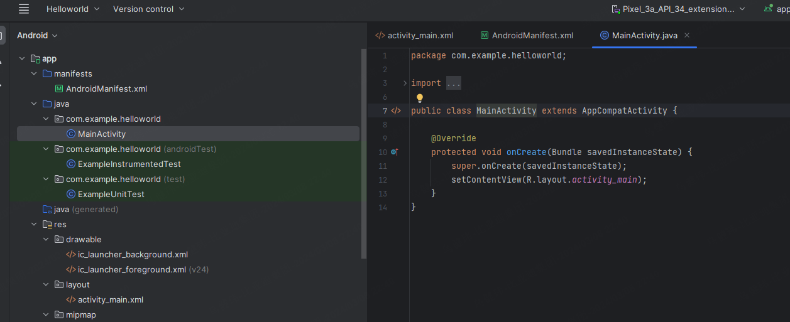
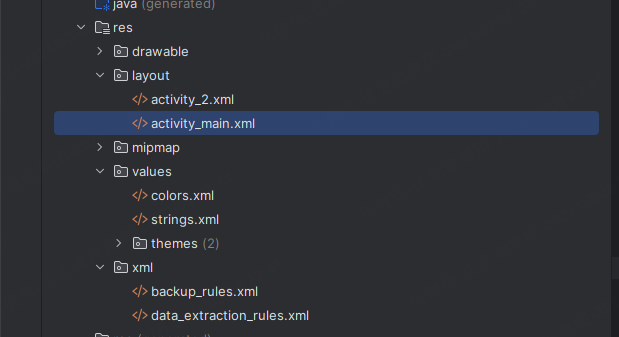

# JAVA&Android

安卓推荐：

尚硅谷 安卓教程

天哥在奔跑 安卓开发教程

程序猿拉大锯 安卓开发自定义组件

动脑学院 kotlin

longway777 jetpack


java基础：韩顺平

尚硅谷：安卓

天哥在奔跑：安卓

longway777： jetpack（主流的开发框架 谷歌出的套件）


安卓基础：activity service provider

学好基础再学kotlin

安卓基础：

尚硅谷Android视频教程《15天精讲精练_参悟Android核心技术—上》

https://www.bilibili.com/video/BV1hW411L7CH/?spm_id_from=333.999.0.0

尚硅谷Android视频教程《15天精讲精练_参悟Android核心技术-中》

https://www.bilibili.com/video/BV1BW411L7QW/?spm_id_from=333.999.0.0&vd_source=d31ec3e5b50ba0ea326786df2a78a612

尚硅谷Android视频教程《15天精讲精练_参悟Android核心技术-下》

https://www.bilibili.com/video/BV1BW411L7th/?spm_id_from=333.999.0.0&vd_source=d31ec3e5b50ba0ea326786df2a78a612


chatgpt给的学习路线建议：

```
对于已经掌握C++和C的开发者来说，进入Android开发领域，建议的学习路径可以分为几个阶段：
1. Java基础
语言基础：学习Java的基本语法、数据类型、控制流程（条件判断、循环）、数组和字符串处理等。
面向对象编程：深入理解类与对象、继承、多态、接口、抽象类等OOP概念。
Java集合框架：熟悉使用List、Set、Map等集合类型，以及它们的实现和使用场景。
异常处理：学习Java的异常处理机制，了解如何抛出和捕获异常。
多线程编程：掌握Java中的多线程基础，包括创建线程、同步、线程池等。
Java新特性：了解Java 8及以后版本引入的新特性，如Lambda表达式、Stream API等。
2. Android基础
Android Studio和工具链：熟悉Android Studio的使用，了解Gradle构建系统。
Android应用架构：学习Android应用的基本组件（Activity、Service、Broadcast Receiver、Content Provider）和生命周期。
用户界面：掌握使用XML和Java/Kotlin构建用户界面，了解布局管理器、控件、事件处理等。
Intent和数据传递：理解Intent如何在不同组件间传递数据，实现应用内部和外部的交互。
数据存储：学习SharedPreferences、SQLite数据库和文件存储等本地数据存储方法。
网络通信：了解如何在Android应用中发起网络请求，处理JSON或XML数据。
3. 进阶学习
高级UI设计：深入学习自定义视图、动画、Material Design风格的组件等。
架构模式和最佳实践：了解MVVM、MVP等架构模式，学习如何构建可维护、可测试的应用。
安全性和性能优化：学习如何保证应用的安全性，以及如何诊断和优化Android应用的性能。
Kotlin：鉴于Kotlin现在是Android官方推荐的语言，可以考虑学习Kotlin，特别是它的协程处理并发编程。
4. 实践和构建项目
小项目实践：通过构建小型应用来实践所学知识，如天气应用、记账应用等。
开源项目贡献：参与开源项目可以让你了解实际项目的开发流程，提高解决问题的能力。
持续学习：技术是不断进步的，持续关注Android和Java生态的最新动态，适时学习新技术和工具。
```


## JAVA


## Android

先学个速成的 看个大概

7天Java0基础速成安卓开发：https://www.bilibili.com/video/BV1G7411t7zs/?spm_id_from=333.337.search-card.all.click&vd_source=d31ec3e5b50ba0ea326786df2a78a612


1.安卓怎么运行

学会看代码

app->manifests->AndroidManifest.xml

app的配置信息 比如icon app的图标 `android:icon="@mipmap/ic_launcher"`这是官方默认图标 在文件夹下：mipmap->ic_launcher 下面有很多图标 是为了适配不同手机像素 就有不同文件去适配


下面这个就比较重要 相当于就是app里的界面

Main就是开机之后出现的第一个界面

后面会学怎么添加界面怎么添加界面的优先级

```java
        <activity
            android:name=".MainActivity"
            android:exported="true">
            <intent-filter>
                <action android:name="android.intent.action.MAIN" />

                <category android:name="android.intent.category.LAUNCHER" />
            </intent-filter>
        </activity>
```


上面可以添加app用到的一些权限

比如 网络权限 获取网络状态 还有蓝牙 定位 总之这里就是放权限的

app->java->com.example.helloworld->MainActivity

这个是放界面控制区的



MainActivity在app->res->layout下面有一个对应的文件

如果改MainActivity中的activity_main 然后按住alt+enter 就可以选create以恶搞新的xml文件


然后默认点ok就行


之后在layout下就有一个新的文件了 这两个是一一对应的

MainActivity

```java
package com.example.helloworld;

import androidx.appcompat.app.AppCompatActivity;

import android.os.Bundle;

public class MainActivity extends AppCompatActivity {//这是安卓最底层的一个框架 MainActivity 依赖于 AppCompatActivity

    @Override
    protected void onCreate(Bundle savedInstanceState) {
        //这是界面打开后 最先运行的地方
        super.onCreate(savedInstanceState);
        setContentView(R.layout.activity_main);//对应界面ui
        //一般先用来运行界面初始化 控件初始化 初始化一些参数和变量
        //不恰当的比方 类似单片机的main函数
    }
}
```

在activity_main.xml布局文件中 可以看design和text 可以互相切换

```xml
<?xml version="1.0" encoding="utf-8"?>
<androidx.constraintlayout.widget.ConstraintLayout xmlns:android="http://schemas.android.com/apk/res/android"
    xmlns:app="http://schemas.android.com/apk/res-auto"
    xmlns:tools="http://schemas.android.com/tools"
    android:layout_width="match_parent"
    android:layout_height="match_parent"
    tools:context=".MainActivity">
    <LinearLayout
        android:layout_width="match_parent"
        android:layout_height="match_parent">
        <TextView
            android:layout_width="wrap_content"
            android:text="hello"
            android:layout_height="wrap_content">

        </TextView>
        <Button
            android:layout_width="wrap_content"
            android:text="yes"
            android:background="@mipmap/ic_launcher"
            android:layout_height="wrap_content">

        </Button>

    </LinearLayout>


</androidx.constraintlayout.widget.ConstraintLayout>
```

constraintlayout：约束布局

LinearLayout：线性布局

match_parent：充满负控件

wrap_content：自适应

TextView：文字

Button：按钮

res里就是放资源的

drawable里放背景图 图标 以及自定义图标 布局文件

layout是放界面的布局文件和图标的

value放和布局相关的 和参数相关的



最下面的Gradle是个很强大的东西 可以远程配置东西的


build.gradle.kts

```kotlin
plugins {
    id("com.android.application")
}

android {//版本
    namespace = "com.example.helloworld"
    compileSdk = 34

    defaultConfig {
        applicationId = "com.example.helloworld"
        minSdk = 21
        targetSdk = 34
        versionCode = 1
        versionName = "1.0"

        testInstrumentationRunner = "androidx.test.runner.AndroidJUnitRunner"
    }

    buildTypes {
        release {
            isMinifyEnabled = false
            proguardFiles(
                getDefaultProguardFile("proguard-android-optimize.txt"),
                "proguard-rules.pro"
            )
        }
    }
    compileOptions {
        sourceCompatibility = JavaVersion.VERSION_1_8
        targetCompatibility = JavaVersion.VERSION_1_8
    }
}

dependencies {//关联一些默认的文件

    implementation("androidx.appcompat:appcompat:1.6.1")
    implementation("com.google.android.material:material:1.11.0")
    implementation("androidx.constraintlayout:constraintlayout:2.1.4")
    testImplementation("junit:junit:4.13.2")
    androidTestImplementation("androidx.test.ext:junit:1.1.5")
    androidTestImplementation("androidx.test.espresso:espresso-core:3.5.1")
}
```


应用层开发的就是最上面那层 两个方向 要么一直在应用层 要么往下


更新JDK

本地的jdk版本比代码需要的高，下载个低版本的就行

解决方法：File -> Settings -> Build, Execution, Deployment -> Build Tools -> Gradle


点ok之后 先同步工程


再编译


Android Studio中布局文件（如activity_main.xml）设计视图&代码视图相互切换

第一个安卓应用

- File->New->New Project

- empty views activity

- 

mainactivity.java


`MainActivity.java` 是在使用 Java 语言开发 Android 应用程序时常见的一个类文件。在 Android 应用的开发中，它通常扮演着应用程序的入口点角色。每当你启动一个 Android 应用时，`MainActivity` 是首个被加载和执行的活动（Activity），负责创建和显示应用程序的主界面。

具体而言，`MainActivity.java` 的作用包括但不限于：

1. **初始化界面：** 它负责加载应用的布局资源（定义在 XML 文件中），并将其显示给用户。这包括设置应用的布局、初始化界面元素等。
2. **处理用户交互：** `MainActivity` 接收并处理来自用户的各种事件，如点击、触摸、键盘输入等。它包含了处理这些用户交互所需的逻辑代码。
3. **生命周期管理：** 在 Android 中，每个 Activity 都有自己的生命周期，`MainActivity` 通过重写生命周期回调方法（如 `onCreate()`, `onStart()`, `onResume()`, `onPause()`, `onStop()`, `onDestroy()` 等）来管理其生命周期，以确保应用的正确运行和资源管理。
4. **导航和管理：** `MainActivity` 可以启动其他的活动（Activities），处理数据传递，以及管理应用内的导航。
5. **集成服务和功能：** 它也可以初始化和集成各种服务和应用功能，比如访问网络数据、使用本地数据库、集成第三方库或服务等。

按住ctrl+鼠标左键 点 activity_main会跳转到activity_main.xml 可以显示代码或图


然后就可以在text里更改显示的文字

然后起一个虚拟机运行即可


安卓项目的目录结构需要深入了解


