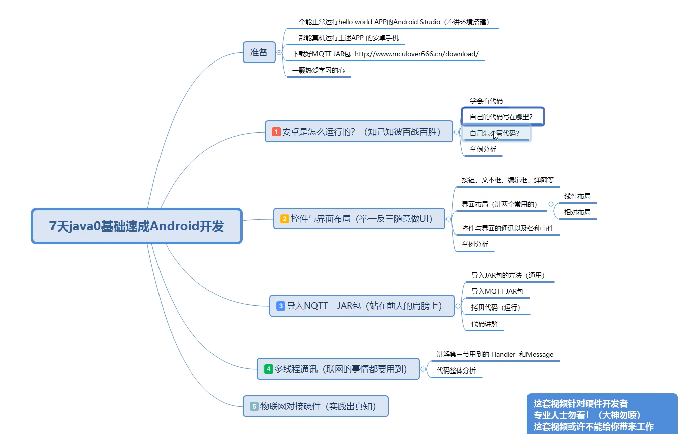

JAVA&Android

安卓推荐：

尚硅谷 安卓教程

天哥在奔跑 安卓开发教程

程序猿拉大锯 安卓开发自定义组件

动脑学院 kotlin

longway777 jetpack


java基础：韩顺平

尚硅谷：安卓

天哥在奔跑：安卓

longway777： jetpack（主流的开发框架 谷歌出的套件）


安卓基础：activity service provider

学好基础再学kotlin

安卓基础：

尚硅谷Android视频教程《15天精讲精练_参悟Android核心技术—上》

https://www.bilibili.com/video/BV1hW411L7CH/?spm_id_from=333.999.0.0

尚硅谷Android视频教程《15天精讲精练_参悟Android核心技术-中》

https://www.bilibili.com/video/BV1BW411L7QW/?spm_id_from=333.999.0.0&vd_source=d31ec3e5b50ba0ea326786df2a78a612

尚硅谷Android视频教程《15天精讲精练_参悟Android核心技术-下》

https://www.bilibili.com/video/BV1BW411L7th/?spm_id_from=333.999.0.0&vd_source=d31ec3e5b50ba0ea326786df2a78a612


chatgpt给的学习路线建议：

```
对于已经掌握C++和C的开发者来说，进入Android开发领域，建议的学习路径可以分为几个阶段：
1. Java基础
语言基础：学习Java的基本语法、数据类型、控制流程（条件判断、循环）、数组和字符串处理等。
面向对象编程：深入理解类与对象、继承、多态、接口、抽象类等OOP概念。
Java集合框架：熟悉使用List、Set、Map等集合类型，以及它们的实现和使用场景。
异常处理：学习Java的异常处理机制，了解如何抛出和捕获异常。
多线程编程：掌握Java中的多线程基础，包括创建线程、同步、线程池等。
Java新特性：了解Java 8及以后版本引入的新特性，如Lambda表达式、Stream API等。
2. Android基础
Android Studio和工具链：熟悉Android Studio的使用，了解Gradle构建系统。
Android应用架构：学习Android应用的基本组件（Activity、Service、Broadcast Receiver、Content Provider）和生命周期。
用户界面：掌握使用XML和Java/Kotlin构建用户界面，了解布局管理器、控件、事件处理等。
Intent和数据传递：理解Intent如何在不同组件间传递数据，实现应用内部和外部的交互。
数据存储：学习SharedPreferences、SQLite数据库和文件存储等本地数据存储方法。
网络通信：了解如何在Android应用中发起网络请求，处理JSON或XML数据。
3. 进阶学习
高级UI设计：深入学习自定义视图、动画、Material Design风格的组件等。
架构模式和最佳实践：了解MVVM、MVP等架构模式，学习如何构建可维护、可测试的应用。
安全性和性能优化：学习如何保证应用的安全性，以及如何诊断和优化Android应用的性能。
Kotlin：鉴于Kotlin现在是Android官方推荐的语言，可以考虑学习Kotlin，特别是它的协程处理并发编程。
4. 实践和构建项目
小项目实践：通过构建小型应用来实践所学知识，如天气应用、记账应用等。
开源项目贡献：参与开源项目可以让你了解实际项目的开发流程，提高解决问题的能力。
持续学习：技术是不断进步的，持续关注Android和Java生态的最新动态，适时学习新技术和工具。
```


## JAVA


## Android

先学个速成的 看个大概

7天Java0基础速成安卓开发：https://www.bilibili.com/video/BV1G7411t7zs/?spm_id_from=333.337.search-card.all.click&vd_source=d31ec3e5b50ba0ea326786df2a78a612




#### 1.安卓怎么运行

学会看代码

app->manifests->AndroidManifest.xml

app的配置信息 比如icon app的图标 `android:icon="@mipmap/ic_launcher"`这是官方默认图标 在文件夹下：mipmap->ic_launcher 下面有很多图标 是为了适配不同手机像素 就有不同文件去适配


下面这个就比较重要 相当于就是app里的界面

Main就是开机之后出现的第一个界面

后面会学怎么添加界面怎么添加界面的优先级

```java
        <activity
            android:name=".MainActivity"
            android:exported="true">
            <intent-filter>
                <action android:name="android.intent.action.MAIN" />

                <category android:name="android.intent.category.LAUNCHER" />
            </intent-filter>
        </activity>
```


上面可以添加app用到的一些权限

比如 网络权限 获取网络状态 还有蓝牙 定位 总之这里就是放权限的

app->java->com.example.helloworld->MainActivity

这个是放界面控制区的


MainActivity在app->res->layout下面有一个对应的文件

如果改MainActivity中的activity_main 然后按住alt+enter 就可以选create以创建新的xml文件

一般先用来进行界面初始化 控件初始化 初始化一些参数和变量 

不恰当比分 这里就类似于单片机的main函数  主要活动就是在这个文件里


然后默认点ok就行


之后在layout下就有一个新的文件了 这两个是一一对应的

MainActivity

```java
package com.example.helloworld;

import androidx.appcompat.app.AppCompatActivity;

import android.os.Bundle;

public class MainActivity extends AppCompatActivity {//这是安卓最底层的一个框架 MainActivity 依赖于 AppCompatActivity

    @Override
    protected void onCreate(Bundle savedInstanceState) {
        //这是界面打开后 最先运行的地方
        super.onCreate(savedInstanceState);
        setContentView(R.layout.activity_main);//对应界面ui
        //一般先用来运行界面初始化 控件初始化 初始化一些参数和变量
        //不恰当的比方 类似单片机的main函数
    }
}
```

在activity_main.xml布局文件中 可以看design和text 可以互相切换

```xml
<?xml version="1.0" encoding="utf-8"?>
<androidx.constraintlayout.widget.ConstraintLayout xmlns:android="http://schemas.android.com/apk/res/android"
    xmlns:app="http://schemas.android.com/apk/res-auto"
    xmlns:tools="http://schemas.android.com/tools"
    android:layout_width="match_parent"
    android:layout_height="match_parent"
    tools:context=".MainActivity">
    <LinearLayout
        android:layout_width="match_parent"
        android:layout_height="match_parent">
        <TextView
            android:layout_width="wrap_content"
            android:text="hello"
            android:layout_height="wrap_content">

        </TextView>
        <Button
            android:layout_width="wrap_content"
            android:text="yes"
            android:background="@mipmap/ic_launcher"
            android:layout_height="wrap_content">

        </Button>

    </LinearLayout>


</androidx.constraintlayout.widget.ConstraintLayout>
```

constraintlayout：约束布局

LinearLayout：线性布局

match_parent：充满负控件

wrap_content：自适应

TextView：文字

Button：按钮

res里就是放资源的

drawable里放背景图 图标 以及自定义图标 布局文件

layout是放界面的布局文件和图标的

value放和布局相关的 和参数相关的


最下面的Gradle是个很强大的东西 可以远程配置东西的


build.gradle.kts

```kotlin
plugins {
    id("com.android.application")
}

android {//版本
    namespace = "com.example.helloworld"
    compileSdk = 34

    defaultConfig {
        applicationId = "com.example.helloworld"
        minSdk = 21
        targetSdk = 34
        versionCode = 1
        versionName = "1.0"

        testInstrumentationRunner = "androidx.test.runner.AndroidJUnitRunner"
    }

    buildTypes {
        release {
            isMinifyEnabled = false
            proguardFiles(
                getDefaultProguardFile("proguard-android-optimize.txt"),
                "proguard-rules.pro"
            )
        }
    }
    compileOptions {
        sourceCompatibility = JavaVersion.VERSION_1_8
        targetCompatibility = JavaVersion.VERSION_1_8
    }
}

dependencies {//关联一些默认的文件

    implementation("androidx.appcompat:appcompat:1.6.1")
    implementation("com.google.android.material:material:1.11.0")
    implementation("androidx.constraintlayout:constraintlayout:2.1.4")
    testImplementation("junit:junit:4.13.2")
    androidTestImplementation("androidx.test.ext:junit:1.1.5")
    androidTestImplementation("androidx.test.espresso:espresso-core:3.5.1")
}
```

up主笔记

```java
第二节开始  目前Java0基础
第二节：
控件（常用的）：   控件（扩展）拖动条 进度条 浏览器框 地图 单选框 复选框
按钮 图片按钮
文本框
编辑框
图片框
选择开关
 wrap_content   自适应
 match_parent    充满父控件
 android:id="@+id/bt_1"   用来和JAVA文件通讯或者说是 绑定事件的
LinearLayout  线性布局
android:orientation="vertical"  设置布局方向  vertical垂直  horizontal水平
android:layout_margin="10dp"    边距

第三节开始   目前java 0基础
安卓开发  要多调试  多刷程序（因为你不知道你的APP程序会什么时候崩溃！！！！）
java里面的操作  大部分都类似于单片机的函数

控件的ID  是java文件与XML文件通讯的介质  类似于控件的 号码牌（唯一）
按钮：
单击事件有很多种实现方法  咱们讲最简单最常用的一种

按钮单机    用来发送命令控制硬件 例如：open door
文本框更新数据   用来接收硬件上报的传感器值  例如：温度 25.6


咱们 不凭空的学安卓开发  咱们是有目的的 直接面向项目和实战。
剩下的交给举一反三

第四节：MQTT Jar导入
复制粘贴！！！
Mqtt_init()
Mqtt_connect()
startReconnect()
爆红不用管！！！
最后赋值
Handler()
#################################
MQTT的知识  保证每个人都能连我的服务器   每个人的ID（MQTT要求唯一）都这设置为自己的QQ号
直接开搞  先跑起来 再讲原理
需要网络权限  和授权！（Android 6.0 以后需要动态授权后面再讲）
连接成功！
开始订阅 topic
拿到数据   想干嘛干嘛   随意做UI
下发控制
发布消息到指定 topic
拷贝发布函数
测试APP发消息  成功！！！
硬件  得到消息  判断 是不是“open_led ”然后 点灯！！
APP   得到消息  判断 传感器 数据  然后  UI展示   温度：56.3

剩下的  交给举一反三！！
```


#### 2.控件与界面布局

控件

res->layout->activity_main.xml

```xml
<?xml version="1.0" encoding="utf-8"?>
<androidx.constraintlayout.widget.ConstraintLayout xmlns:android="http://schemas.android.com/apk/res/android"
    xmlns:app="http://schemas.android.com/apk/res-auto"
    xmlns:tools="http://schemas.android.com/tools"
    android:layout_width="match_parent"
    android:layout_height="match_parent"
    tools:context=".MainActivity">

    <LinearLayout
        android:layout_width="match_parent"
        android:layout_height="match_parent">

        <TextView
            android:layout_width="56dp"
            android:layout_height="190dp"
            android:rotationX="2"
            android:text="hello">

        </TextView>

        <Button
            android:layout_width="wrap_content"
            android:layout_height="wrap_content"
            android:background="@mipmap/ic_launcher"
            android:text="yes">

        </Button>

    </LinearLayout>


</androidx.constraintlayout.widget.ConstraintLayout>
```


平常用的控件：按钮 图片按钮 选择开关 文本框 编辑框 图片框

java的注释跟c语言一样

控件：常用的
按钮 图片按钮

到阿里的图库去找ui下载png：https://www.iconfont.cn/

配色表：https://www.peisebiao.com/

准备一个文件夹去放ui

在Android开发中，"dp" 表示 "density-independent pixel"，即密度无关像素，它是一种用于描述屏幕上元素大小的单位。与像素（pixel）不同，dp 考虑了屏幕的密度，因此在不同密度的屏幕上，相同的 dp 值可以呈现相似大小的元素。

LinearLayout代表线性布局 这是最常用和最好用的一个布局方法

首先线性布局充满整个负控件的 其他布局都在线性布局里面

```java
    <LinearLayout
        android:layout_width="match_parent"
        android:orientation="vertical"
        android:gravity="center"
        android:layout_height="match_parent">
```

android:orientation="vertical"：设置布局方向 默认水平

android:gravity="center"设置居中


不要去拖动图标位置 使用代码来实现你想要的任何效果

```java
        <Button
            android:layout_width="40dp"
            android:layout_height="40dp"
            android:background="@drawable/open"
            android:text="yes"
            android:textColor="#ff2e63"
            android:layout_gravity="bottom"
            android:id="@+id/bt_1">

        </Button>
```

线性布局除了button 还可以放很多的东西

android:layout_gravity="bottom" 单独控制

带layout的就是用来控制布局的

id是用来和java文件通讯或者绑定的

文本框

```java
        <TextView
            android:layout_width="wrap_content"
            android:layout_height="wrap_content"
            android:textSize="30sp"
            android:id="@+id/text_1"
            android:text="OH LA LA"/>
```

`> </Button>` 和 `/>`完全相等

编辑框

```java
        <EditText
            android:layout_width="wrap_content"
            android:hint="please input"
            android:layout_height="wrap_content"/>
```

android:hint:让用户输入

反正遇到什么就查 就百度 就chatgpt 属性什么的都可以查

图片框

```java
        <ImageView
            android:layout_width="wrap_content"
            android:src="@drawable/open"
            android:layout_height="wrap_content"/>
```

这个src用background也可以

选择开关

```java
 <SeekBar
            android:layout_width="wrap_content"
            android:layout_height="wrap_content"/>
```

做一个这个界面


分界 就可以把它们分为很多liner_layout


先搞懂线性布局 后面再讲相对布局

边距margin

```xml
<ImageView
                android:layout_width="wrap_content"
                android:layout_margin="10dp"
                android:src="@drawable/dolphin"
                android:layout_height="wrap_content"/>
```

可以做成轮播图的效果 网上有教程可以找找看怎么做

默认布局是水平 所以会一直往右排 改成垂直

```xml
android:orientation="vertical"
```

均分需要一个东西叫重心 当一个LinearLayout中的子视图都设置了`layout_weight`属性时，它们会按照权重来分配可用的空间。在这种情况下，`layout_weight`属性值越大，该视图占用的空间就越多。 例如，如果一个LinearLayout中有两个子视图，它们的`layout_weight`属性分别设置为1和2，那么第一个视图将占据1/3的可用空间，而第二个视图将占据2/3的可用空间。

```xml
android:layout_weight="1"
```

activity_main.xml

```xml
<?xml version="1.0" encoding="utf-8"?>
<androidx.constraintlayout.widget.ConstraintLayout xmlns:android="http://schemas.android.com/apk/res/android"
    xmlns:app="http://schemas.android.com/apk/res-auto"
    xmlns:tools="http://schemas.android.com/tools"
    android:layout_width="match_parent"
    android:layout_height="match_parent"
    tools:context=".MainActivity">


    <LinearLayout
        android:layout_width="match_parent"
        android:background="#e3fdfd"
        android:orientation="vertical"
        android:layout_height="match_parent">
        <LinearLayout
            android:layout_width="match_parent"
            android:background="#f6f6f6"

            android:layout_height="251dp">
            <ImageView
                android:layout_width="wrap_content"
                android:layout_margin="10dp"
                android:src="@drawable/dolphin"
                android:layout_height="wrap_content">

            </ImageView>

        </LinearLayout>

        <LinearLayout
            android:layout_width="match_parent"
            android:orientation="vertical"
            android:layout_marginTop="20dp"

            android:layout_height="wrap_content">
            <LinearLayout
                android:layout_width="match_parent"
                android:layout_height="wrap_content">
                <LinearLayout
                    android:layout_width="wrap_content"
                    android:orientation="vertical"
                    android:layout_height="wrap_content">
                    <ImageView
                        android:layout_width="140dp"
                        android:layout_height="100dp"
                        android:id="@+id/image_1"
                        android:layout_weight="1"
                        android:src="@drawable/light">

                    </ImageView>
                    <TextView
                        android:layout_width="wrap_content"
                        android:layout_gravity="center"
                        android:textSize="20sp"
                        android:layout_height="wrap_content"
                        android:text="开关">

                    </TextView>

                </LinearLayout>
                <LinearLayout
                    android:layout_width="wrap_content"
                    android:orientation="vertical"
                    android:layout_height="wrap_content">
                    <ImageView
                        android:layout_width="140dp"
                        android:layout_height="100dp"
                        android:layout_weight="1"
                        android:src="@drawable/door_security">

                    </ImageView>
                    <TextView
                        android:layout_width="wrap_content"
                        android:layout_gravity="center"
                        android:textSize="20sp"
                        android:layout_height="wrap_content"
                        android:text="门禁">

                    </TextView>

                </LinearLayout>
                <LinearLayout
                    android:layout_width="wrap_content"
                    android:orientation="vertical"
                    android:layout_height="wrap_content">
                    <ImageView
                        android:layout_width="140dp"
                        android:layout_height="100dp"
                        android:layout_weight="1"
                        android:src="@drawable/fan">

                    </ImageView>
                    <TextView
                        android:layout_width="wrap_content"
                        android:layout_gravity="center"
                        android:textSize="20sp"
                        android:layout_height="wrap_content"
                        android:text="风扇">

                    </TextView>

                </LinearLayout>


            </LinearLayout>
            <LinearLayout
                android:layout_width="match_parent"
                android:layout_marginTop="20dp"
                android:layout_height="wrap_content">
                <LinearLayout
                    android:layout_width="wrap_content"
                    android:orientation="vertical"
                    android:layout_height="wrap_content">
                    <ImageView
                        android:layout_width="140dp"
                        android:layout_height="100dp"
                        android:layout_weight="1"
                        android:src="@drawable/temp">

                    </ImageView>
                    <TextView
                        android:layout_width="wrap_content"
                        android:layout_gravity="center"
                        android:textSize="20sp"
                        android:layout_height="wrap_content"
                        android:text="温度">

                    </TextView>

                </LinearLayout>
                <LinearLayout
                    android:layout_width="wrap_content"
                    android:orientation="vertical"
                    android:layout_height="wrap_content">
                    <ImageView
                        android:layout_width="140dp"
                        android:layout_height="100dp"
                        android:layout_weight="1"
                        android:src="@drawable/radar">

                    </ImageView>
                    <TextView
                        android:layout_width="wrap_content"
                        android:layout_gravity="center"
                        android:textSize="20sp"
                        android:layout_height="wrap_content"
                        android:text="雷达">

                    </TextView>

                </LinearLayout>
                <LinearLayout
                    android:layout_width="wrap_content"
                    android:orientation="vertical"
                    android:layout_height="wrap_content">
                    <ImageView
                        android:layout_width="140dp"
                        android:layout_height="100dp"
                        android:layout_weight="1"
                        android:src="@drawable/pm">

                    </ImageView>
                    <TextView
                        android:layout_width="wrap_content"
                        android:layout_gravity="center"
                        android:textSize="20sp"
                        android:layout_height="wrap_content"
                        android:text="pm2.5">

                    </TextView>
                </LinearLayout>
            </LinearLayout>
            <Button
                android:layout_width="wrap_content"
                android:text="测试开关"
                android:id="@+id/btn_1"
                android:layout_height="wrap_content">

            </Button>
        </LinearLayout>
    </LinearLayout>

</androidx.constraintlayout.widget.ConstraintLayout>
```

后面讲事件和控件怎么绑定就也就这些控件 里面他们的id 怎么和java文件进行同步

#### 3.控件与界面通讯

控件的ID是java的文件与xml文件通讯的介质 类似于控件的号码牌（唯一）

常用控件：

按钮：按钮的单击事件

首先要先有一个id 才能来操作他

```xml
                    <ImageView
                        android:layout_width="140dp"
                        android:layout_height="100dp"
                        android:id="@+id/image_1"
                        android:layout_weight="1"
                        android:src="@drawable/light">

                    </ImageView>
```

在java这边就要绑定

```java
 image_1 = findViewById(R.id.image_1);
```

单机事件有很多种实现方法 讲最简单的 最常用的一种

java里面的操作 大部分都类似c的函数

安卓开发 要多调试 多刷程序 因为不知道你的app程序会什么时候崩溃


MainActivity.java

```java
package com.example.woowoowoo;

import androidx.appcompat.app.AppCompatActivity;

import android.os.Bundle;
import android.view.View;
import android.widget.Button;
import android.widget.ImageView;
import android.widget.Toast;

public class MainActivity extends AppCompatActivity {
    private Button btn_1; //类似单片机中初始化
    private ImageView image_1;

    @Override
    protected void onCreate(Bundle savedInstanceState) {
        super.onCreate(savedInstanceState);
        setContentView(R.layout.activity_main);
        btn_1 = findViewById(R.id.btn_1); //寻找xml里面的id与自己定义的id进行绑定
        //然后就可以实现按钮的单击事件了
        //设置监听
        btn_1.setOnClickListener(new View.OnClickListener() {
            @Override
            public void onClick(View v) {
                //这里就是单机之后 执行的地方
                System.out.println("hello");//java里面的debug日志打印
                //更直观的方法 用弹窗：toast
                //第一个参数 当前的界面 第二个参数 内容  第三个参数 显示的长度
                //在当前activity显示内容为hello的短时间弹窗
                Toast.makeText(MainActivity.this, "hello", Toast.LENGTH_SHORT).show();
            }
        });
        image_1 = findViewById(R.id.image_1);
        image_1.setOnClickListener(new View.OnClickListener() {
            @Override
            public void onClick(View v) {
                Toast.makeText(MainActivity.this, "我是第一个图片", Toast.LENGTH_SHORT).show();

            }
        });


    }
}
```

效果：

点击按钮前


点击按钮后：


每按一下 下面的调试窗口就会显示一下


然后就可以做前面几个图的事件了

实现点击图片 然后让下面的文字变化 实现模块联动

两个控件联动 ：单机按钮 更改textview的内容


`ui_init()`然后按alt+enter 就会创建方法

然后把初始化的东西都放到这个函数里 这样代码更整洁一些

```java
    private void ui_init() {
        btn_1 = findViewById(R.id.btn_1); //寻找xml里面的id与自己定义的id进行绑定
        image_1 = findViewById(R.id.image_1);
        text_test = findViewById(R.id.text_test);//实现绑定

    }
```

之后可以这么写 优化了更简洁一些 

现在还是可以按之前的 绑定 然后操作

MainActivity.java

```java
package com.example.woowoowoo;

import androidx.appcompat.app.AppCompatActivity;

import android.os.Bundle;
import android.view.View;
import android.widget.Button;
import android.widget.ImageView;
import android.widget.TextView;
import android.widget.Toast;

public class MainActivity extends AppCompatActivity {
    private Button btn_1; //类似单片机中初始化
    private ImageView image_1;
    private TextView text_test;
    @Override
    protected void onCreate(Bundle savedInstanceState) {
        super.onCreate(savedInstanceState);
        setContentView(R.layout.activity_main);
        ui_init();

        //然后就可以实现按钮的单击事件了
        //设置监听
        btn_1.setOnClickListener(new View.OnClickListener() {
            @Override
            public void onClick(View v) {
                //这里就是单机之后 执行的地方
                System.out.println("hello");//java里面的debug日志打印
                //更直观的方法 用弹窗：toast
                //第一个参数 当前的界面 第二个参数 内容  第三个参数 显示的长度
                //在当前activity显示内容为hello的短时间弹窗
                Toast.makeText(MainActivity.this, "hello", Toast.LENGTH_SHORT).show();
            }
        });

        image_1.setOnClickListener(new View.OnClickListener() {
            @Override
            public void onClick(View v) {
                Toast.makeText(MainActivity.this, "我是第一个图片", Toast.LENGTH_SHORT).show();
                //用到文本框的一个方法
                text_test.setText("我是新的内容");
            }
        });
    }

    private void ui_init() {
        btn_1 = findViewById(R.id.btn_1); //寻找xml里面的id与自己定义的id进行绑定
        image_1 = findViewById(R.id.image_1);
        text_test = findViewById(R.id.text_test);//实现绑定

    }
}
```

activity_main.xml

```xml
<?xml version="1.0" encoding="utf-8"?>
<androidx.constraintlayout.widget.ConstraintLayout xmlns:android="http://schemas.android.com/apk/res/android"
    xmlns:app="http://schemas.android.com/apk/res-auto"
    xmlns:tools="http://schemas.android.com/tools"
    android:layout_width="match_parent"
    android:layout_height="match_parent"
    tools:context=".MainActivity">


    <LinearLayout
        android:layout_width="match_parent"
        android:background="#e3fdfd"
        android:orientation="vertical"
        android:layout_height="match_parent">
        <LinearLayout
            android:layout_width="match_parent"
            android:background="#f6f6f6"

            android:layout_height="251dp">
            <ImageView
                android:layout_width="wrap_content"
                android:layout_margin="10dp"
                android:src="@drawable/dolphin"
                android:layout_height="wrap_content">

            </ImageView>

        </LinearLayout>

        <LinearLayout
            android:layout_width="match_parent"
            android:orientation="vertical"
            android:layout_marginTop="20dp"

            android:layout_height="wrap_content">
            <LinearLayout
                android:layout_width="match_parent"
                android:layout_height="wrap_content">
                <LinearLayout
                    android:layout_width="wrap_content"
                    android:orientation="vertical"
                    android:layout_height="wrap_content">
                    <ImageView
                        android:layout_width="140dp"
                        android:layout_height="100dp"
                        android:id="@+id/image_1"
                        android:layout_weight="1"
                        android:src="@drawable/light">

                    </ImageView>
                    <TextView
                        android:layout_width="wrap_content"
                        android:layout_gravity="center"
                        android:textSize="20sp"
                        android:layout_height="wrap_content"
                        android:text="开关">

                    </TextView>

                </LinearLayout>
                <LinearLayout
                    android:layout_width="wrap_content"
                    android:orientation="vertical"
                    android:layout_height="wrap_content">
                    <ImageView
                        android:layout_width="140dp"
                        android:layout_height="100dp"
                        android:layout_weight="1"
                        android:src="@drawable/door_security">

                    </ImageView>
                    <TextView
                        android:layout_width="wrap_content"
                        android:layout_gravity="center"
                        android:textSize="20sp"
                        android:layout_height="wrap_content"
                        android:text="门禁">

                    </TextView>

                </LinearLayout>
                <LinearLayout
                    android:layout_width="wrap_content"
                    android:orientation="vertical"
                    android:layout_height="wrap_content">
                    <ImageView
                        android:layout_width="140dp"
                        android:layout_height="100dp"
                        android:layout_weight="1"
                        android:src="@drawable/fan">

                    </ImageView>
                    <TextView
                        android:layout_width="wrap_content"
                        android:layout_gravity="center"
                        android:textSize="20sp"
                        android:layout_height="wrap_content"
                        android:text="风扇">

                    </TextView>

                </LinearLayout>


            </LinearLayout>
            <LinearLayout
                android:layout_width="match_parent"
                android:layout_marginTop="20dp"
                android:layout_height="wrap_content">
                <LinearLayout
                    android:layout_width="wrap_content"
                    android:orientation="vertical"
                    android:layout_height="wrap_content">
                    <ImageView
                        android:layout_width="140dp"
                        android:layout_height="100dp"
                        android:layout_weight="1"
                        android:src="@drawable/temp">

                    </ImageView>
                    <TextView
                        android:layout_width="wrap_content"
                        android:layout_gravity="center"
                        android:textSize="20sp"
                        android:layout_height="wrap_content"
                        android:text="温度">

                    </TextView>

                </LinearLayout>
                <LinearLayout
                    android:layout_width="wrap_content"
                    android:orientation="vertical"
                    android:layout_height="wrap_content">
                    <ImageView
                        android:layout_width="140dp"
                        android:layout_height="100dp"
                        android:layout_weight="1"
                        android:src="@drawable/radar">

                    </ImageView>
                    <TextView
                        android:layout_width="wrap_content"
                        android:layout_gravity="center"
                        android:textSize="20sp"
                        android:layout_height="wrap_content"
                        android:text="雷达">

                    </TextView>

                </LinearLayout>
                <LinearLayout
                    android:layout_width="wrap_content"
                    android:orientation="vertical"
                    android:layout_height="wrap_content">
                    <ImageView
                        android:layout_width="140dp"
                        android:layout_height="100dp"
                        android:layout_weight="1"
                        android:src="@drawable/pm">

                    </ImageView>
                    <TextView
                        android:layout_width="wrap_content"
                        android:layout_gravity="center"
                        android:textSize="20sp"
                        android:layout_height="wrap_content"
                        android:text="pm2.5">

                    </TextView>
                </LinearLayout>
            </LinearLayout>
            <Button
                android:layout_width="wrap_content"
                android:text="测试开关"
                android:id="@+id/btn_1"
                android:layout_height="wrap_content">

            </Button>
            <TextView
                android:layout_width="wrap_content"
                android:text="我是原来的内容"
                android:id="@+id/text_test"
                android:layout_height="wrap_content">

            </TextView>
            
        </LinearLayout>
    </LinearLayout>

</androidx.constraintlayout.widget.ConstraintLayout>
```


后面要做的：

按钮单机用来发送命令控制硬件 例如：open door

文本框更新数据 用来接收硬件上报的传感器值 例如：温度 25.6

不凭空学安卓开发 而是有目的的直接面向项目实战

等学好 剩下的交给举一反三就可以了


按钮有很多属性


控件（扩展):浏览器框 地图 进度条 单选框  复选框


界面


应用层开发的就是最上面那层 两个方向 要么一直在应用层 要么往下


更新JDK

本地的jdk版本比代码需要的高，下载个低版本的就行

解决方法：File -> Settings -> Build, Execution, Deployment -> Build Tools -> Gradle


点ok之后 先同步工程


再编译


Android Studio中布局文件（如activity_main.xml）设计视图&代码视图相互切换

第一个安卓应用

- File->New->New Project

- empty views activity

- 

mainactivity.java


`MainActivity.java` 是在使用 Java 语言开发 Android 应用程序时常见的一个类文件。在 Android 应用的开发中，它通常扮演着应用程序的入口点角色。每当你启动一个 Android 应用时，`MainActivity` 是首个被加载和执行的活动（Activity），负责创建和显示应用程序的主界面。

具体而言，`MainActivity.java` 的作用包括但不限于：

1. **初始化界面：** 它负责加载应用的布局资源（定义在 XML 文件中），并将其显示给用户。这包括设置应用的布局、初始化界面元素等。
2. **处理用户交互：** `MainActivity` 接收并处理来自用户的各种事件，如点击、触摸、键盘输入等。它包含了处理这些用户交互所需的逻辑代码。
3. **生命周期管理：** 在 Android 中，每个 Activity 都有自己的生命周期，`MainActivity` 通过重写生命周期回调方法（如 `onCreate()`, `onStart()`, `onResume()`, `onPause()`, `onStop()`, `onDestroy()` 等）来管理其生命周期，以确保应用的正确运行和资源管理。
4. **导航和管理：** `MainActivity` 可以启动其他的活动（Activities），处理数据传递，以及管理应用内的导航。
5. **集成服务和功能：** 它也可以初始化和集成各种服务和应用功能，比如访问网络数据、使用本地数据库、集成第三方库或服务等。

按住ctrl+鼠标左键 点 activity_main会跳转到activity_main.xml 可以显示代码或图


然后就可以在text里更改显示的文字

然后起一个虚拟机运行即可


安卓项目的目录结构需要深入了解


#### 4.导入物联网通讯的mqtt的jar包


首先导入mqtt的jar包

之后除了mqtt的jar包可以导入 蓝牙的 各种都可以 就相当于c语言中的库 别人开发好了的 直接调用库就好了 

第五节课讲硬件 马上就能上手用

最后再讲handler和message这个多线程的东西

jar包下载地址：https://repo.eclipse.org/content/repositories/paho-releases/org/eclipse/paho/org.eclipse.paho.client.mqttv3/1.2.0/

用jar包有多种方式 这种是下载下来 还有一种是gradle 也有其他方法远程来下载

导入jar包 正常是在android 先切到Project 然后按下面的方式导入

粘贴到Project->app->lib

然后右键 add as library

放在app下面就可以了

之后就是学习怎么调用别人写好的

添加成功后就可以在这个文件下看到已经添加好了


这个build.gradle就是用来配置一些插件 或者外置的库的 其实也可以直接添加地址 它会自动联网去下载（这个等下学下怎么导） 

然后就可以直接调用mqtt的这些函数 注意大写

注释 先选中要注释的行 然后按住ctrl+/ 就都能注释了

很多红的地方 按alt+enter就能解决 选择用安卓的还是java的库

复制粘贴就能解决大部分问题

权限放在manifest里面


要加上这两个才有网络权限 和授权（android6.0以后需要动态授权 动态授权后面讲）


新的变量设好

```java
    private ImageView image_1;//类似单片机中初始化
    private ImageView image_2;
//    private TextView text_test;
    private boolean isImage1 = true;
    private boolean isImage2 = true;
    private String host = "tcp://10.45.98.182:1883";
    private String userName = "android";
    private String passWord = "android";
    private String mqtt_id = "1045927662"; //定义成自己的QQ号  切记！不然会掉线！！！
    private String mqtt_sub_topic = "1045927662"; //为了保证你不受到别人的消息  订阅主题 得唯一
    private String mqtt_pub_topic = "1045927662_PC"; //为了保证你不受到别人的消息  哈哈  自己QQ好后面加 _PC
    private ScheduledExecutorService scheduler;
    private Handler handler;
    private MqttClient client;
    private MqttConnectOptions options;
```

mqtt初始化

```java
        private void Mqtt_init()
    {
        try {
            //host为主机名，test为clientid即连接MQTT的客户端ID，一般以客户端唯一标识符表示，MemoryPersistence设置clientid的保存形式，默认为以内存保存
            client = new MqttClient(host, mqtt_id,
                    new MemoryPersistence());
            //MQTT的连接设置
            options = new MqttConnectOptions();
            //设置是否清空session,这里如果设置为false表示服务器会保留客户端的连接记录，这里设置为true表示每次连接到服务器都以新的身份连接
            options.setCleanSession(false);
            //设置连接的用户名
            options.setUserName(userName);
            //设置连接的密码
            options.setPassword(passWord.toCharArray());
            // 设置超时时间 单位为秒
            options.setConnectionTimeout(10);
            // 设置会话心跳时间 单位为秒 服务器会每隔1.5*20秒的时间向客户端发送个消息判断客户端是否在线，但这个方法并没有重连的机制
            options.setKeepAliveInterval(20);
            //设置回调
            client.setCallback(new MqttCallback() {
                @Override
                public void connectionLost(Throwable cause) {
                    //连接丢失后，一般在这里面进行重连
                    System.out.println("connectionLost----------");
                    //startReconnect();
                }
                @Override
                public void deliveryComplete(IMqttDeliveryToken token) {
                    //publish后会执行到这里
                    System.out.println("deliveryComplete---------"
                            + token.isComplete());
                }
                @Override
                public void messageArrived(String topicName, MqttMessage message)
                        throws Exception {
                    //subscribe后得到的消息会执行到这里面
                    System.out.println("messageArrived----------");
                    Message msg = new Message();
                    msg.what = 3;   //收到消息标志位
                    msg.obj = topicName + "---" + message.toString();
                    handler.sendMessage(msg);    // hander 回传
                }
            });
        } catch (Exception e) {
            e.printStackTrace();
        }
    }
```

mqtt连接服务器

```java
   private void Mqtt_connect() {
        new Thread(new Runnable() {
            @Override
            public void run() {
                try {
                    if(!(client.isConnected()) )  //如果还未连接
                    {
                        System.out.println("Mqtt_connect");//java里面的debug日志打印
                        client.connect(options);
                        Message msg = new Message();
                        msg.what = 31;
                        handler.sendMessage(msg);
                    }
                } catch (Exception e) {
                    e.printStackTrace();
                    Message msg = new Message();
                    msg.what = 30;
                    handler.sendMessage(msg);
                }
            }
        }).start();
    }
```

mqtt重连

```java
 private void startReconnect() {
        scheduler = Executors.newSingleThreadScheduledExecutor();
        scheduler.scheduleAtFixedRate(new Runnable() {
            @Override
            public void run() {
                if (!client.isConnected()) {
                    System.out.println("startReconnect");//java里面的debug日志打印
                    Mqtt_connect();
                }
            }
        }, 0 * 1000, 10 * 1000, TimeUnit.MILLISECONDS);
    }
```

handler处理 注意 这个要写在onCreate里面 其他那些写在外面

```java
 handler = new Handler() {
            @SuppressLint("SetTextI18n")
            public void handleMessage(Message msg) {
                super.handleMessage(msg);
                switch (msg.what){
                    case 1: //开机校验更新回传
                        break;
                    case 2:  // 反馈回传

                        break;
                    case 3:  //MQTT 收到消息回传   UTF8Buffer msg=new UTF8Buffer(object.toString());
                        Toast.makeText(MainActivity.this,msg.obj.toString() ,Toast.LENGTH_SHORT).show();
                        //这一句就是把mqtt收到的消息打印出来

                        break;
                    case 30:  //连接失败
                        System.out.println("连接失败");//java里面的debug日志打印
                        Toast.makeText(MainActivity.this,"连接失败" ,Toast.LENGTH_SHORT).show();
                        break;
                    case 31:   //连接成功
                        System.out.println("连接成功");//java里面的debug日志打印
                        Toast.makeText(MainActivity.this,"连接成功" ,Toast.LENGTH_SHORT).show();
                        try {
                            client.subscribe(mqtt_sub_topic,1);//订阅
                        } catch (MqttException e) {
                            e.printStackTrace();
                        }
                        break;
                    default:
                        break;
                }
            }
        };
```

up主自己写的publish的函数 封装了一下publish

```java
 private void publishmessageplus(String topic,String message2)
    {
        if (client == null || !client.isConnected()) {
            return;
        }
        MqttMessage message = new MqttMessage();
        message.setPayload(message2.getBytes());
        try {
            client.publish(topic,message);
        } catch (MqttException e) {

            e.printStackTrace();
        }
    }
```


mqtt的知识 保证每个人都能连up主的服务器 每个人的ID都设置为自己的qq号 因为要唯一

连接成功后就订阅消息

拿到数据 想干嘛干嘛 随意做UI

下发控制

发布消息到指定topic

拷贝发布函数

测试app发消息 成功

剩下的交给举一反三

今天先实现功能 明天再讲原理

下节课讲handler和message 因为是联网的 联网一般就用到异步通信 多线程 

把代码调通

##### mqtt服务器搭建

服务器就启动了


emqx的管理端口：http://localhost:18083/#/login?to=/dashboard/overview


修改了密码为：david96530

用本机地址也能连上：127.0.0.1:18083

测试一下这个服务器 能否实现主题发送与订阅

可以自测


订阅之后可以正常发送消息的话说明服务器没有问题了


这个就说明搭建完成了 

把代码调通后就可以开始连接服务器

首先把ip地址改好 用主机的ipv4地址

```java
private String host = "tcp://10.45.98.182:1883";
```

一旦run程序 会自动连上服务器 服务器上就会显示


并且手机上会显示连接成功  （但目前还是会先显示个连接失败）


logcat也会打印


本地下载使用mqtt.fx来发消息 设置里面可以写配置 用本地地址 端口是1883去connect


mqtt是即时通信

connect之后服务器


然后就可以互相通信了

从mqtt.fx发送到手机

输入订阅主题 内容 然后就publish


手机收到就说明通信成功


然后设置一段代码 publish发给mqtt.fx


加到点击的事件里

mqtt里订阅主题


然后就点击事件 触发 


能收到就说明两边是通的


以项目为目的 这样更有兴趣 


