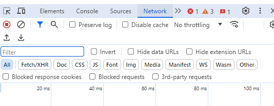
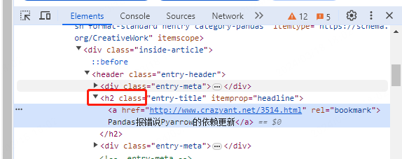
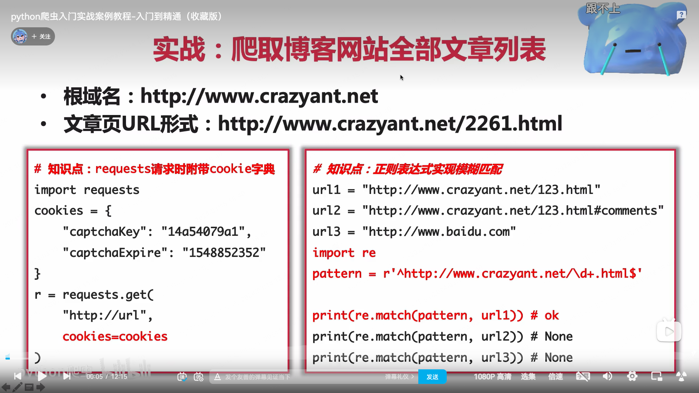
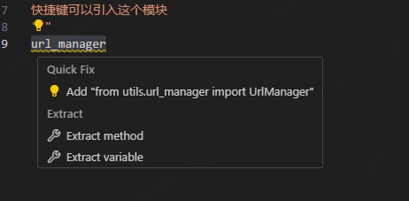

# python爬虫入门实战案例教程-入门到精通（收藏版）

https://www.bilibili.com/video/BV1CY411f7yh?p=4&spm_id_from=pageDriver&vd_source=d31ec3e5b50ba0ea326786df2a78a612


三个模块相互配合 让这个爬虫不断的进行爬取

其中URL管理器给出新的URL 然后网页下载器进行内容的下载 对于下载的内容 网页解析器进行解析 得到我们所需要的数据 以及补充新的URL给URL管理器

只要URL管理器中有新的URL进来 那这个爬虫就会一直爬新的URL

这个就是任何一个爬虫所需要的三个核心的模块

而对于并发爬取 我们可以通过在爬虫的调度端进行爬取

而解析出来的数据 我们除了存到文件中 也可以存到数据库 就可以在最后数据存储进行扩展

有些网页是通过动态加载的 我们使用简单的网页下载器没法搞定 我们就可以使用slenium这个框架来应对

#### request网页下载库


这个模块可以把我们指定的url的网页代码下载下来


接收数据


安装ipython 安装完后陪下环境变量并source一下

```shell
python3 -m pip install ipython
```

使用ipython：shell输入ipython

```
In [12]: history
clear
import requests
uel = "http://www.crazyant.net"
url = "http://www.crazyant.net"
r = request.get(url)
r = requests.get(url)
r.status_code
r.headers
r.encoding
r.text
r.cookies
history
```

基本方法：

要使用requests这个模块 首先导入

import requests

导入requests库 记得有s

request.get

```
In [7]: r.status_code
Out[7]: 200
```

查看status_code 真正写代码的时候可以判断一下这个返回码是不是200 200表示获取成功

常用属性：

r.headers

```python
In [8]: r.headers
Out[8]: {'Server': 'nginx', 'Date': 'Sun, 17 Mar 2024 11:46:25 GMT', 'Content-Type': 'text/html; charset=UTF-8', 'Transfer-Encoding': 'chunked', 'Connection': 'keep-alive', 'Vary': 'Accept-Encoding', 'X-UA-Compatible': 'IE=edge', 'Link': '<http://www.crazyant.net/wp-json/>; rel="https://api.w.org/"', 'Content-Encoding': 'gzip'}
```

首先知道了‘Content-Type': 'text/html

并且制定了charset=UTF-8

但有些网站的Content-Type不带编码信息  如果不带编码 那会默认的设置为：'ISO-8859-1' 有些中文可能会导致乱码

r.encoding

```
In [9]: r.encoding
Out[9]: 'UTF-8'
```

其实我们request会自动的检测headers去取这个编码 同时对内容进行解析

r.text

能正常解析内容 无论是中英文

r.cookies

```python
In [26]: r.cookies
Out[26]: <RequestsCookieJar[Cookie(version=0, name='BDORZ', value='27315', port=None, port_specified=False, domain='.baidu.com', domain_specified=True, domain_initial_dot=True, path='/', path_specified=True, secure=False, expires=1710762556, discard=False, comment=None, comment_url=None, rest={}, rfc2109=False)]>
```


对于爬虫中文乱码的时候 解决方法

```python
r.encoding="utf-8"
```

再爬就可以了

因为很默认是

```python
In [18]: r.encoding
Out[18]: 'ISO-8859-1'
```

#### URL管理器


这个管理器是爬虫的基础

网页执行的链接错综复杂 如果不管理的话就会出现重复 或者说循环爬取的情况

对外表现：1.从里面拿一个url出来 2.往里面放新的url

#### URL管理器的代码实现

url_manager.py

```python
class UrlManager():
    """
    url管理器
    可以使用两个python set来定义待爬行的url和爬取过的url的集合 
    old的是来自new的 当爬取完一个url就可以把这个url从new放到old的set里
    同时也需要把这个url从new中去除掉
    """
    def __init__(self):
        self.new_urls = set()
        self.old_urls = set()
    
    """
    首先初始化 对自己进行初始化
    """
    """
    1.新增url 2.取出待爬取的url 
    """
    """
    首先判断这个url是否合格 不合格就不让它添加了
    接下来需要判断这个url是不是已经在容器里面了 只要在这里面 就不添加了
    """
    def add_new_url(self, url):
        if url is None or len(url) == 0:
            return
        if url in self.new_urls or url in self.old_urls:
            return
        self.new_urls.add(url)


    """
    一般取出来的url是很多个 这是新增url的两个方法 因为网页中解析出来的可能会是很多个 就加一个urls的
    这样就是批量添加url的方法
    """
    def add_new_urls(self, urls):
        if urls is None or len(urls) == 0:
            return
        for url in urls:
            self.add_new_url(url)

    """
    也需要得到爬取到待爬取的url的方法
    pop可以从集合里移除一个元素 并且返回
    取完这个url之后 把这个url标记为已爬取
    否则 如果容器里没有url了的话 return None
    """
    def get_url(self):
        if self.has_new_url():
            url = self.new_urls.pop()
            self.old_urls.add(url)
            return url
        else: 
            return None

    """
    判断get_url中得到的新增的url在管理器里有没有
    """
    def has_new_url(self):
        return len(self.new_urls) > 0

    """
    这样就定义完了这个类要向外提供的所有方法
    """
    
    
    
    
    """
    这样可以写一段测试代码
    下面if __name__ == "__main__": 加上这个判断的作用是 如果别的模块引用这个模块 就不会引入和执行下面的代码
    """

if __name__ == "__main__":
    """
    首先创建对象
    """
    url_manager = UrlManager()

    url_manager.add_new_url("url1")
    url_manager.add_new_urls(["url1", "url2"])
    print(url_manager.new_urls, url_manager.old_urls)
    
    print("#"*30)
    """
    测试从中取一个url
    """
    new_url = url_manager.get_url()
    print(url_manager.new_urls, url_manager.old_urls)
    print(url_manager.has_new_url())
    
    print("#"*30)
    """
    再从中取一个url
    """
    new_url = url_manager.get_url()
    print(url_manager.new_urls, url_manager.old_urls)
    print(url_manager.has_new_url())
    
    print("#"*30)

    print(url_manager.has_new_url())
```

打印结果


#### html简介


标签


class一般用来编写样式 一般是有css样式的


#### 网页解析器


要对网页的源码 也就是文本进行解析 提取里面的超链接以及内容 正常情况有几种方式 

1.正则表达式进行匹配

源码很乱的时候 提取困难 并且会遇到很多格式化的问题

2.使用beautiful soup的第三方开源代码


第一步


第二步


最后找到节点后 就能访问节点的信息


爬虫工作流程：

1.首先会使用request从网上下载一个url 

2.然后把它的文本字符串传给beautiful soup

3.之后使用beautiful soup的findall找到我们所需要的节点

4.最后访问这个节点的名称 属性 文字 得到我们所需要的目标数据


解析html

```
<html>
	<head>
        <meta http-equiv=Content-Type content="text/html;charset=utf-8">
        <title>网页标题</title>
    </head>
	<body>
		<h1>标题1</h1>
        <h2>标题2</h2>
        <h3>标题3</h3>
        <h4>标题4</h4>

	<div id="content" class="default">
		<p>段落</p>
		<a href="http://www.baidu.com">百度</a> <br/>
        <a href="http://www.crazyant.net">疯狂的蚂蚁</a> <br/>
        <a href="http://www.iqiyi.com">疯狂的蚂蚁</a> <br/>

		
    </div>
	</body>
</html>

```

test.py

```python
"""
第一步 引入模块
"""
from bs4 import BeautifulSoup
"""
接下来把字符串读取出来
使用with语法可以打开html 这样后面不用close 会自动关闭
fin.read可以读取整个文本
这样就实现了把html的文本读取到这个字符串里
"""
with open("./test.html") as fin:
    html_doc = fin.read()

"""
然后就要使用beautifulsoup
1.创建对象
第一个参数传入html_doc 第二个参数"html.parser" 第三个参数这里可以不传 因为这个文件默认编码是utf-8的 所以这里可以不传
"""

soup = BeautifulSoup(html_doc, "html.parser")

"""
2.查找所有节点
可以查找所有的超链接 直接传入一个a
就可以访问节点的名称 节点的属性 节点的文本内容
运行就会发现 名称就是a 属性就是url 内容就是对应的文本
"""


links = soup.find_all("a")
for link in links:
    print(link.name, link["href"], link.get_text())

"""
确认只有一个图片才能这么取 
直接print图片的属性 也就是url
"""
img = soup.find("img")
print(img["src"])

"""
正常我们的网页有很多很多的超链接 也有很多很多的图片
一般会先定位到区域块 比如
<div id="content" class="default">......</div>
先取到这个区域块的内容 
然后在这个区域块的本身里面再寻找超链接和图片
这样就把复杂度降低了
就可以先查找大的区块 再在大的区块里查找目标的数据
"""

print("#"*30)
"""
我们可以先查找div 然后在div的子区块里再查找url
在html中 一个节点如果有id属性的话 那么这个id是全局唯一的 如果有class属性的话 class一般不是全局唯一的
所以id代表某一个 class代表某一类
之后我们查找就可以把soup替换成div_node了
这样就可以进行子区域的查找和分析
当然如果网页比较简单 直接soup.find_all就可以了
"""
div_node = soup.find("div", id="content")
print(div_node)
print("#"*30)

links = div_node.find_all("a")
for link in links:
    print(link.name, link["href"], link.get_text())

img = div_node.find("img")
print(img["src"])
```

以上的代码就实现了 

beautifulsoup库的导入:`from bs4 import BeautifulSoup`

创建一个对象:`soup = BeautifulSoup(html_doc, "html.parser")`

创建对象的参数就包含html的字符串 以及指令parser

然后就可以用find和find_all去找目标的节点:`links = soup.find_all("a")`

最后使用name 字典的方式访问属性 和get_text来获取节点的内容 :`print(link.name, link["href"], link.get_text())`

#### 爬虫前对目标网站进行分析

1.从源码角度 知道数据隐藏在源码的哪一部分

2.我们的爬虫怎么跟这个网站进行交互

进入一个网站 有几个方法可以对这个网站进行探索

1.右键->显示网页源代码（ctrl+u）

打开的这个网页的内容就是我这个网页的html的源代码

我们网页除了会从服务器拉取源代码之外 还会加载一些javascript 然后这个网页会在执行了javascript之后展现给大家

但view-source查看的源代码没有经过javascript执行

2.右键->检查

会弹出一个框  这个框里有几个type会经常用到

一个是elements 一个是network


elements展示的是给用户的源码 跟刚才的网页源代码不一样 也就是说他可能已经加载了一些javascript动态加载之后给我们进行展示

我们用python获取url 实际上是看不到这种很全的内容的 这种动态加载的网站 我们可以用slenium这个插件来搞定 

而slenium就是模拟一个浏览器去真正下载html加载javascript 把最终用户看到的内容给呈现出来

elements还有一个功能就是定位某个元素对应的位置是什么 ：选中文本->右键->检查


还有个功能叫做network 也非常重要和常用 这个network相当于一个抓包



刷新这个页面


会展现这个页面加载的时间

下方会展现我请求了那个url

菜单上有几个功能：

1.preserve log 如果我们跨网页访问的话这个页面会一直保存不会丢失 如果不点的话 他到下一个网页日志就刷新了 没有之前网页的日志了

2.因为我们是爬虫 所以一般会点上disable cache 不然可能会从本地取数据 那我们爬虫爬到的结果会和表现的不一致


3.而对于羡慕的列表 我们一般会选Doc 因为我们要抓的是数据 


就会找到想应的url 我们点这个url 在右边会看到一些标签


第一个是Headers 非常有用

请求的url

我们浏览器请求这个网页的方法

status code 这是服务端返回给我们的一个状态码 如果=200说明请求成功

对于有些网站 如果没有user-agent会被禁掉

我们可以自己设一个 就会被当成正常人的访问被处理

cookie也是类似的道理

第一次访问会给你一些cookie 那后面要把这个cookie带上

response里面看到的跟view-source里面看到的是一样的


我们要在爬虫前经常用到的就几个

1.右键->源代码

2.右键->检查 出来的elements和network两个type里面所展示的功能


#### 【实战】提取一个网站所有的文本和链接

首先 分析标题链接处于这个html的哪一部分

然后 右键->检查 就可以看看这个标题大概是什么class 就可以推断出其他 大概也是这个class  



```
在Python中，特别是在使用像BeautifulSoup这样的库进行网页解析时，`class`是一个Python关键字，用于定义类。因此，当你需要使用一个属性名`class`来匹配HTML元素的类属性时，直接使用`class`会导致语法错误，因为Python会把它当作关键字而不是字符串。

为了避免这个问题，BeautifulSoup使用`class_`（在`class`后面加一个下划线）作为一个特殊参数，允许你搜索具有特定CSS类的HTML元素。这个下划线是一个常见的Python约定，用于避免命名冲突与关键字。在BeautifulSoup的内部实现中，`class_`参数被用来匹配HTML元素的`class`属性。

这样，你就可以在BeautifulSoup中安全地使用`class_`来搜索具有特定CSS类名的元素，而不会与Python的`class`关键字冲突。
```

main.py

```python
url = "http://www.crazyant.net"
"""
第一步 去获取这个url的文本
"""
import requests
r = requests.get(url)
"""
如果不等于200 就会直接退出这个程序
raise Exception 就是程序出现问题 不往下执行了
"""
if r.status_code != 200:
    raise Exception
"""
提取文档内容
"""
html_doc = r.text


"""
第二步 对取到的数据进行解析
"""
from bs4 import BeautifulSoup
soup = BeautifulSoup(html_doc, "html.parser")
"""
正如分析 我们可以先查找h2的列表
"""
h2_nodes = soup.find_all("h2", class_ = "entry-title")
"""
h2_node就是一个超链接
所以可以继续进行查找
"""
for h2_node in h2_nodes:
    link = h2_node.find("a")
    print(link["href"], link.get_text())


"""
这样我们就查到了所有的h2 class限定为entry-title
然后对每个h2 我们查到了里面的超链接
最后打印每个超链接里面的url 以及它的文本内容
"""
```

这就是一个简单的爬虫 后面爬小说 爬图片都是这么一个套路

1.指定url

2.下载内容

3.提取数据

#### 【实战】爬取所有博客页面



cookie如果不加 会访问安全检测的网页 要绕开的话就带上这个cookies字典就好了

cookie的key和expire从哪来

我们可以通过 右键->检查->network 里面找到 把一些所需要的key复制进去就可以

然后在获取url的时候 可以通过cookies=设置的字典的方式来覆盖字典 就是请求url的时候可以增加覆盖一个cookies

用正则表达式 只爬取文章页的页面

import re 就是正则表达式的库

```python
pattern = r'^http://www.carzyant.net/\d+.html$'
```

r开头 代表后面 'xxxx' 里面是一个正则表达式 里面的 `\d` 不用解析 然后我们就赋值这个 `\d`代表一个数字 `\d+`代表很多个数字 这样这一串就把第一个url匹配出来了 但第二个也会被匹配出来 如果加了`^......$`分别放在开头和结束 通过这种方式就只会匹配第一个url 第二个不是html结尾的

然后使用re.match的方法 把pattern传给第一个参数 就能判断url是否符合这个pattern 如果符合的话就会返回一个匹配成功的对象 如果没有匹配成功就会返回none 通过这个限定就能让我们匹配为url1

演示正则表达式的使用(ipython)

re是python自带的一个库 不用自己安装

我们做一个判断 就是这三个url哪一个符合最终的文章页的形式

`\d`代表匹配符 数字 `\d+`代表很多个数字

```python
In [1]: import re

In [2]: url1 = "http://www.crazyant.net/1234.html"

In [3]: url2 = "http://www.crazyant.net/1234.html#comments"

In [4]: url3 = "http://www.baidu.com"

In [10]: pattern = r'^http://www.crazyant.net/\d+.html$'
    
In [11]: re.match(pattern, url1)
Out[11]: <re.Match object; span=(0, 33), match='http://www.crazyant.net/1234.html'>
    
In [11]: re.match(pattern, url2)
    
In [13]: re.match(pattern, url3)
```

下面两个都是返回none

只有第一个match

下面进行实战演示

爬取整站所有的url 于是就用到url管理器 每次新增url就新增到url管理器中 要爬取的时候 就从这个url管理器中取出一个新的

回顾一下url_manager 

里面有两个数据结构：new_urls 新爬取 old_urls爬取过的

url_manager_py

```python
class UrlManager():
    """
    url管理器
    可以使用两个python set来定义待爬行的url和爬取过的url的集合 
    old的是来自new的 当爬取完一个url就可以把这个url从new放到old的set里
    同时也需要把这个url从new中去除掉
    """
    def __init__(self):
        self.new_urls = set()
        self.old_urls = set()
    
    """
    首先初始化 对自己进行初始化
    """
    """
    1.新增url 2.取出待爬取的url 
    """
    """
    首先判断这个url是否合格 不合格就不让它添加了
    接下来需要判断这个url是不是已经在容器里面了 只要在这里面 就不添加了
    """
    def add_new_url(self, url):
        if url is None or len(url) == 0:
            return
        if url in self.new_urls or url in self.old_urls:
            return
        self.new_urls.add(url)


    """
    一般取出来的url是很多个 这是新增url的两个方法 因为网页中解析出来的可能会是很多个 就加一个urls的
    这样就是批量添加url的方法
    """
    def add_new_urls(self, urls):
        if urls is None or len(urls) == 0:
            return
        for url in urls:
            self.add_new_url(url)

    """
    也需要得到爬取到待爬取的url的方法
    pop可以从集合里移除一个元素 并且返回
    取完这个url之后 把这个url标记为已爬取
    否则 如果容器里没有url了的话 return None
    """
    def get_url(self):
        if self.has_new_url():
            url = self.new_urls.pop()
            self.old_urls.add(url)
            return url
        else: 
            return None

    """
    判断get_url中得到的新增的url在管理器里有没有
    """
    def has_new_url(self):
        return len(self.new_urls) > 0

    """
    这样就定义完了这个类要向外提供的所有方法
    """
    
    
    
    
    """
    这样可以写一段测试代码
    下面if __name__ == "__main__": 加上这个判断的作用是 如果别的模块引用这个模块 就不会引入和执行下面的代码
    """

if __name__ == "__main__":
    """
    首先创建对象
    """
    url_manager = UrlManager()

    url_manager.add_new_url("url1")
    url_manager.add_new_urls(["url1", "url2"])
    print(url_manager.new_urls, url_manager.old_urls)
    
    print("#"*30)
    """
    测试从中取一个url
    """
    new_url = url_manager.get_url()
    print(url_manager.new_urls, url_manager.old_urls)
    print(url_manager.has_new_url())
    
    print("#"*30)
    """
    再从中取一个url
    """
    new_url = url_manager.get_url()
    print(url_manager.new_urls, url_manager.old_urls)
    print(url_manager.has_new_url())
    
    print("#"*30)

    print(url_manager.has_new_url())
```



craw_all_pages.py

```python
"""
定义入口url
"""

from bs4 import BeautifulSoup
import requests
import url_manager
import re
# 首先定义入口url

root_url = "http://www.crazyant.net/"
"""
定义一个urlManager
快捷键可以引入这个模块
"""
urls = url_manager.UrlManager()
# 把这个root url放到urlmanager里面
urls.add_new_url(root_url)
# 把结果写到文件里
fout = open("craw_all_pages.txt", "w")
# 这时候 我们已经初始化了urlmanager 我们就可以一直从里面取出我们的url进行爬取 把新的链接放到这个url管理器里
while urls.has_new_url():
    # 有就取出
    curr_url = urls.get_url()
    # 实现这个url的爬取 因为我们要爬取很多的网站 为了防止卡在某一个上 加一个timeout属性
    r = requests.get(curr_url, timeout=3)
    # 如果request失败的话
    if r.status_code != 200:
        print("error, return status_code is not 200", curr_url)
        continue

    # 这时候就说明爬取成功了 我们就可以解析这个网页 得到我们要的数据
    # 传入r.txt
    soup = BeautifulSoup(r.text, "html.parser")
    # soup.title可以得到title这个节点 。string可以得到里面的文字
    title = soup.title.string

    fout.write("%s\t%s\n"%(curr_url, title))
    # 因为写出的时候 经常会缓存一部分数据在内存 最后才批量写出到磁盘 如果想很快看到信息可以用flush 也就是把内存中的数据刷到磁盘里
    fout.flush()
    # 同时 成功爬取的时候 我们可以把url管理器里面的数目打印一下
    print("success:%s, %s, %d"%(curr_url, title, len(urls.new_urls)))
# 这样 我们就实现了这个url的爬取 解析 以及目标数据的获取和写出
# 还有件事 就是不能忘了把这个页面中新的url中提取出来 放到url管理器里 这样 这个管理器才能一直不停的运行
    # 我们使用find all所有的链接来进行
    links = soup.find_all("a")
    for link in links:
        # 因为有些超链接是不标准的 这个href可能取不到 就continue 不管这个url了
        # href = link["href"]
        href = link.get("href")
        if href is None:
            continue

        # 判断是不是我们要的文章的url 就需要用正则表达式来判断
        pattern = r'^http://www.crazyant.net/\d+.html$'
        if re.match(pattern, href):
            # 如果匹配的话 我们再把这个url添加到url管理器里面
            urls.add_new_url(href)

fout.close()
```

这样就完成了一个博客网站 所有文章页面的爬取

首先初始化一个url管理器 把rooturl添加进去

每取一个新的url 我们就实现request.get来爬取它的内容

然后我们把它传入beautifulsoup来解析 获取我们需要的数据

然后将这些数据进行文件输出

之后不能忘记把这些爬取到的新的url 添加到url管理器中

在判断url是否符合我们的要求的时候使用正则表达式 使用match的方法看我们的url是不是匹配这个模式

这个代码实现了一个网站几乎所有页面的爬取

#### 【实战】爬取豆瓣电影250的榜单

网址：https://movie.douban.com/top250


